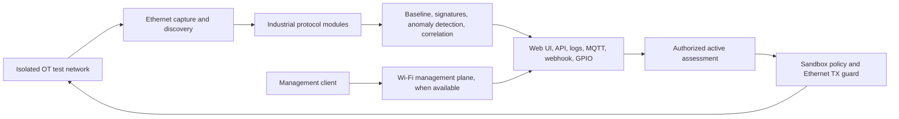

# ESP32 OT Security Assessment

Experimental, ESP-IDF-based firmware for observing and assessing industrial Operational Technology (OT) networks from an ESP32-class edge device. The project combines Ethernet capture and discovery, protocol-aware analysis, anomaly and signature detection, controlled active-assessment modules, reporting, and an embedded web interface.

> [!IMPORTANT]
> This is research software under active test. All three listed boards have been exercised on physical hardware, but complete or production-grade functionality is **not** yet guaranteed. Use it only in an isolated laboratory or on systems for which you have explicit authorization. Do not expose the management interface to an untrusted network.

## Project scope

The firmware is designed to explore whether a small embedded device can provide a practical security-assessment point near an OT segment. Current modules include:

- Ethernet and Wi-Fi network management, where the target hardware supports them;
- passive discovery, network-presence tracking, packet and flow processing;
- experimental protocol modules for Modbus/TCP, Siemens S7, EtherNet/IP, PROFINET, and OPC UA;
- baselining, anomaly detection, signature detection, and event correlation;
- vulnerability-scanning and fuzzing workflows protected by policy and transmission guards;
- an embedded web UI and API;
- serial, GPIO, MQTT, and webhook reporting paths;
- NVS/LittleFS persistence and PSRAM-aware data structures.

Individual protocol and assessment features have different maturity levels. A successful build does not mean that every module is complete or validated against every PLC, network layout, or protocol implementation.



## Tested hardware

The following status describes observations from this project, not a general limitation of the manufacturers' hardware.

| Device | Project status | Web transport | Network separation | Important limitations observed in this project |
|---|---|---|---|---|
| LILYGO T-POE Pro | Works in current tests | **HTTP only** | Wi-Fi can provide a separate management path | HTTPS has not worked reliably in this firmware; HTTP exposes management traffic in cleartext. |
| Waveshare ESP32-S3-ETH | Works on a limited set of tested networks | HTTPS with a generated self-signed certificate | Wi-Fi and Ethernet are available | Network compatibility is currently limited; there is no native 24 V input and no GPIO screw-terminal block. |
| Waveshare ESP32-P4-ETH | Best current functional result | HTTPS with a generated self-signed certificate | **Not achieved** with this board alone | ESP32-P4 has no native Wi-Fi, so the web server shares the OT Ethernet subnet and the required management/OT separation is lost. |

### LILYGO T-POE Pro

<p align="center">
  
</p>

The T-POE Pro uses an ESP32-WROVER-E, LAN8720 Ethernet PHY, 16 MB flash, 8 MB PSRAM, onboard PoE, a 7-24 V input, and screw terminals. The firmware profile uses PHY address `0`, reset on GPIO `5`, MDC on GPIO `23`, MDIO on GPIO `18`, and the RMII reference clock on GPIO `0`.

In this project the board currently runs the web server over plain HTTP on port 80. Treat that profile as the least secure option: use an isolated, trusted management network and never send reusable credentials across an untrusted segment.

<p align="center">
  
</p>

- [Manufacturer product page and official store](https://lilygo.cc/products/t-poe-pro)
- [Manufacturer source, pin maps, and schematics](https://github.com/Xinyuan-LilyGO/LilyGO-T-ETH-Series)

### Waveshare ESP32-S3-ETH

<p align="center">
  
</p>

This board combines an ESP32-S3R8 with 16 MB flash, 8 MB PSRAM, 2.4 GHz Wi-Fi, and a W5500 10/100 Ethernet controller. The W5500 SPI mapping used by the firmware is SCLK GPIO `13`, MOSI GPIO `11`, MISO GPIO `12`, CS GPIO `14`, interrupt GPIO `10`, and reset GPIO `9`.

It can maintain a Wi-Fi management path separate from wired OT traffic, but the project has so far worked only on a limited set of test networks. Power is via USB/5 V or an optional PoE accessory; the board does not provide the project's desired native 24 V input or field-oriented GPIO screw terminals.

<p align="center">
  
</p>

- [Official hardware documentation](https://www.waveshare.com/wiki/ESP32-S3-ETH)
- [Manufacturer product page and official store](https://www.waveshare.com/esp32-s3-eth.htm)

### Waveshare ESP32-P4-ETH

<p align="center">
  
</p>

The ESP32-P4-ETH uses the ESP32-P4 and an IP101GRI 10/100 Ethernet PHY. The firmware profile uses PHY address `1`, reset on GPIO `51`, MDC on GPIO `31`, MDIO on GPIO `52`, and the external RMII clock on GPIO `50`.

This is the strongest-performing target in current functional tests. Its architectural limitation is decisive, however: ESP32-P4 has no integrated Wi-Fi. With the board alone, the management web server must be reachable over the same Ethernet subnet being assessed, which violates the project's intended separation between management and OT networks.

<p align="center">
  
</p>

- [Official hardware documentation](https://www.waveshare.com/wiki/ESP32-P4-ETH)
- [Manufacturer product page and official store](https://www.waveshare.com/esp32-p4-eth.htm)

Image provenance and attribution are recorded in [docs/assets/hardware/SOURCES.md](docs/assets/hardware/SOURCES.md).

## Build prerequisites

- Git with submodule support;
- Python 3.10 or newer;
- the repository setup script, which creates a local `.venv` and installs PlatformIO Core plus esptool;
- the [PlatformIO extension for Visual Studio Code](https://marketplace.visualstudio.com/items?itemName=platformio.platformio-ide) for the graphical workflow;
- [ESP-IDF 5.5](https://docs.espressif.com/projects/esp-idf/en/v5.5/esp32p4/get-started/index.html) is also supported for the ESP32-P4 native build path;
- a USB data cable and the appropriate serial driver for the selected board.

Clone recursively because `esp_littlefs` contains its own LittleFS submodule:

```bash
git clone --recurse-submodules https://github.com/il-prof-f-a/ESP32-OT-Security-Assessment.git
cd ESP32-OT-Security-Assessment
```

If the repository was cloned without submodules, repair it with:

```bash
git submodule update --init --recursive
```

## Quick installation

The setup scripts install all project-local host dependencies into `.venv`,
initialize the `esp_littlefs` submodule, and leave the system Python packages
untouched. Python and Git themselves must already be installed. PlatformIO
downloads the Espressif frameworks and toolchains during the first build, so
that build can take several minutes.

On Windows PowerShell:

```powershell
Set-ExecutionPolicy -Scope Process Bypass
.\scripts\setup_platformio.ps1
# Optional: install the VS Code PlatformIO extension as well.
.\scripts\setup_platformio.ps1 -InstallVsCodeExtension
```

On Linux or macOS:

```bash
chmod +x scripts/*.sh
./scripts/setup_platformio.sh
# Optional VS Code extension installation.
INSTALL_VSCODE_EXTENSION=1 ./scripts/setup_platformio.sh
```

For command-line work, activate the local environment (or call its Python
executable explicitly):

```powershell
.\.venv\Scripts\Activate.ps1
```

```bash
source .venv/bin/activate
```

Open the `ESP32-OT-Security-Assessment` folder in VS Code after setup. Select
the local `.venv` interpreter if prompted, then use **PlatformIO: Build**,
**PlatformIO: Upload**, and **PlatformIO: Monitor**. The PlatformIO task tree
shows `t-poe-pro`, `esp32-s3-eth`, and `waveshare-esp32p4-eth`; no serial port is
hard-coded in the repository, so select the connected COM/TTY port in the
PlatformIO device picker.

## Automatic credential provisioning

The first build automatically creates cryptographically random local credentials and a new RSA-2048 self-signed TLS certificate. Provisioning runs from both the PlatformIO and native ESP-IDF build paths. No default password, private key, certificate, or populated runtime configuration is committed to this repository.

The credential directory is selected in this order:

1. `ESP32_OT_CREDENTIALS_DIR`, when explicitly set;
2. an existing `credentials` directory next to this repository;
3. `.credentials` inside this repository for a standalone clone.

The generated directory contains:

- `credentials.json` — generated administrator and provisioning-AP credentials;
- `config.json` — conservative initial runtime configuration;
- `server.crt` — self-signed server certificate;
- `server.key` — matching private key.

These paths are ignored by Git. Back them up securely if the deployed device must keep the same identity. Deleting them intentionally causes the next build to create a new credential set. Do not paste their contents into issues, logs, screenshots, or commits.

To keep credentials outside the checkout:

```powershell
$env:ESP32_OT_CREDENTIALS_DIR = 'D:\secure\esp32-ot-credentials'
pio run -e esp32-s3-eth
```

```bash
export ESP32_OT_CREDENTIALS_DIR="$HOME/.config/esp32-ot-security-assessment"
pio run -e esp32-s3-eth
```

## Build and flash

Use PlatformIO for all three boards:

```bash
# LILYGO T-POE Pro (HTTP-only management in the current firmware)
pio run -e t-poe-pro

# Waveshare ESP32-S3-ETH
pio run -e esp32-s3-eth

# Waveshare ESP32-P4-ETH
pio run -e waveshare-esp32p4-eth
```

The P4 environment pins the `pioarduino/platform-espressif32` fork to the
hardware-tested revision and uses the local board definition plus the
RISC-V toolchain compatibility script in `scripts/fix_esp32p4_toolchain_path.py`.
The stock `espressif32@6.12.0` platform must not be substituted: it selects an
Xtensa toolchain for `esp32p4`. A native ESP-IDF 5.5 build remains available as
an alternative. This forked PlatformIO path is experimental and pinned to keep
the build inputs reproducible while upstream ESP32-P4 support evolves:

```bash
# Run this from an activated ESP-IDF 5.5 shell.
idf.py -B build-esp32p4 -D IDF_TARGET=esp32p4 build
```

The CMake configuration selects `sdkconfig.esp32p4.defaults`, provisions credentials automatically, enables HTTPS, and applies the Waveshare IP101GRI/RMII pin mapping. To flash the P4 after a successful build:

```bash
idf.py -B build-esp32p4 -p SERIAL_PORT flash
```

See PlatformIO's [open ESP32-P4 support request](https://github.com/platformio/platform-espressif32/issues/1570) for the upstream status.

Connect the board, then let PlatformIO detect the serial port or provide it explicitly:

```bash
pio run -e t-poe-pro -t upload --upload-port COM10
pio run -e esp32-s3-eth -t upload --upload-port COM10
pio device monitor --port COM10 --baud 115200
```

On Linux, a port typically resembles `/dev/ttyUSB0` or `/dev/ttyACM0`.

### One-command build, flash, and monitor wrappers

The wrappers use `.venv` automatically when it exists and accept the target and
serial port explicitly. Build only:

```powershell
.\scripts\build_flash.ps1 -Target t-poe-pro
```

Build, flash, and then attach the serial monitor on Windows:

```powershell
.\scripts\build_flash.ps1 -Target t-poe-pro -Port COM10 -Upload -Monitor
```

The equivalent POSIX command is:

```bash
./scripts/build_flash.sh --target t-poe-pro --port /dev/ttyUSB0 --upload --monitor
```

Use `--no-build` (or `-NoBuild`) only when the selected build artifacts already
exist. The wrapper does not guess a port and refuses upload/monitor operations
without one.

### Explicit esptool workflow

The Python helper builds the selected PlatformIO environment and then invokes
esptool. This is useful in CI or when the PlatformIO graphical upload task is
not available:

```bash
python scripts/flash_esptool.py --target t-poe-pro --port COM10
```

To flash artifacts from a build that has already completed:

```bash
python scripts/flash_esptool.py --target t-poe-pro --port COM10 --no-build
```

The helper uses the target-specific esptool chip (`esp32`, `esp32s3`, or
`esp32p4`) and the partition table in `partitions.csv`. The current layout is:

| Image | Flash offset |
|---|---:|
| Bootloader | `0x1000` |
| Partition table | `0x8000` |
| Factory application (`firmware.bin`) | `0x200000` |

For a fully explicit command, first build the target and replace `BUILD_DIR`
with the resulting PlatformIO directory:

```bash
python -m esptool --chip esp32 --port COM10 --baud 921600 write-flash \
  --flash-mode dio --flash-freq 40m --flash-size detect \
  0x1000 "BUILD_DIR/bootloader.bin" \
  0x8000 "BUILD_DIR/partitions.bin" \
  0x200000 "BUILD_DIR/firmware.bin"
```

On Windows the default build directory is usually
`%USERPROFILE%\\.platformio\\build\\ESP32-OT-Security-Assessment\\t-poe-pro`;
on Linux/macOS it is normally
`~/.platformio/build/ESP32-OT-Security-Assessment/t-poe-pro`. Use `esp32s3`
for `esp32-s3-eth` and `esp32p4` for `waveshare-esp32p4-eth`.

If the board does not appear, use a USB **data** cable and enter bootloader mode
(hold **BOOT**, press and release **RESET**, then release **BOOT**) before
retrying. Install the board's USB/UART driver if no COM/TTY device is visible.
The default esptool reset sequence returns the board to the application after a
successful write; do not interrupt power while the flash is in progress.

## Testing

Run the host-side provisioning and build-integration tests without hardware:

```bash
python -m unittest discover -s tests -p "test_*.py"
```

The remaining scripts under `tests/` exercise a live device, including API security, rate limiting, IDS behavior, memory telemetry, OPC UA, and EtherNet/IP soak validation. Read [tests/README.md](tests/README.md) before running them. Some scripts intentionally generate hostile or high-rate traffic and must be used only in an authorized lab.

## Repository layout

```text
boards/                 Custom PlatformIO board metadata
components/esp_littlefs LittleFS ESP-IDF component and nested submodule
docs/assets/hardware/   Hardware images and source attribution
scripts/                Build-time UI and credential generation
src/assessment/         Detection, baselining, scanning, and correlation
src/core/               Configuration, storage, scheduling, logging
src/network/            Ethernet, Wi-Fi, packet, and flow handling
src/protocols/          Industrial protocol modules
src/reporters/          Serial, GPIO, MQTT, and webhook outputs
src/sandbox/            Active-assessment policy and transmission guards
src/security/           Authentication and security controls
src/web/                Embedded HTTP/HTTPS server, API, and web UI
tests/                  Host-side and live-device validation tools
```

## Known limitations and roadmap

The main engineering limitations are tracked in [GitHub Issues](https://github.com/il-prof-f-a/ESP32-OT-Security-Assessment/issues). In particular, the project still needs a secure web transport on T-POE Pro, broader ESP32-S3 network validation, a management/OT separation strategy for ESP32-P4, repeatable multi-target CI, and further lifecycle and memory hardening.

Security-sensitive findings that would enable exploitation may be handled privately until a fix is available. For a vulnerability report, do not open a public issue containing exploit details, credentials, private network data, or device logs with sensitive content.

## License

This project is source-available under the [PolyForm Noncommercial License 1.0.0](LICENSE.md). It permits the noncommercial uses described in the license; it is not an OSI-approved open-source license. Contact the copyright holder before any commercial use.

Third-party components and hardware images remain subject to their own licenses and rights.
