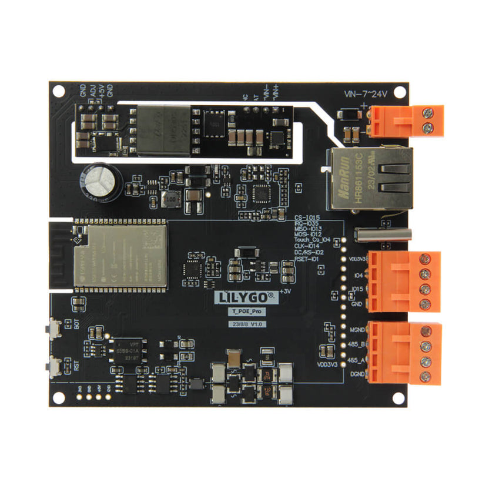
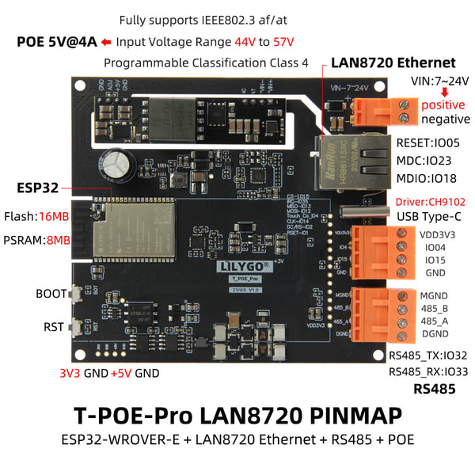
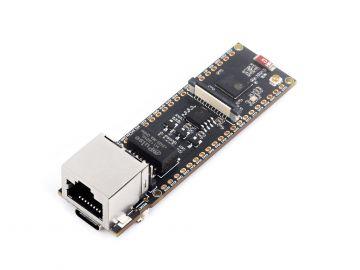
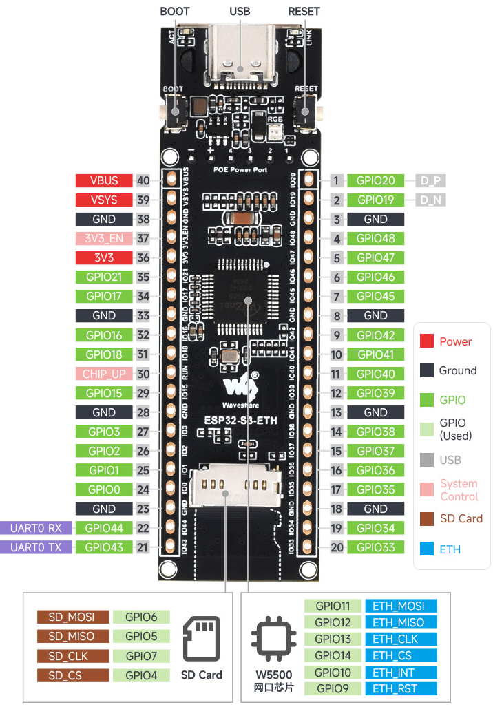
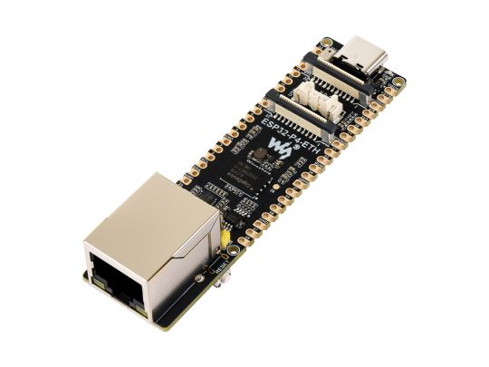
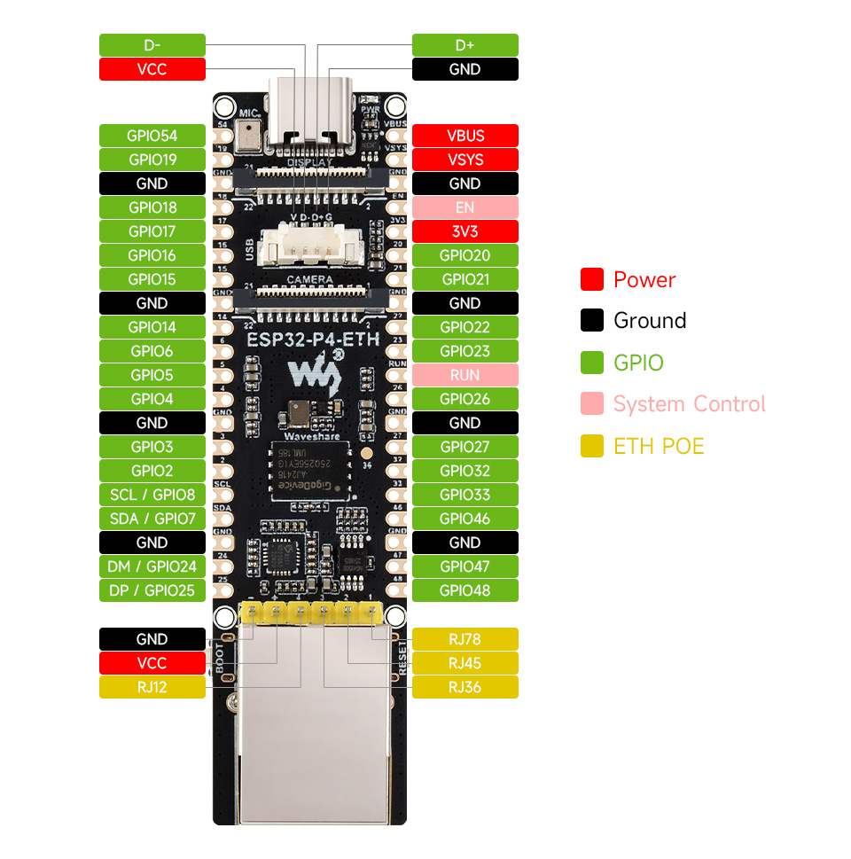

# ESP32 OT Security Assessment

[](https://github.com/il-prof-f-a/ESP32-OT-Security-Assessment/actions/workflows/host-tests.yml)
[](https://github.com/il-prof-f-a/ESP32-OT-Security-Assessment/actions/workflows/release.yml)

Experimental ESP32 firmware for passive observation and authorized security assessment of
operational-technology protocols. The project combines Ethernet/Wi-Fi connectivity, a management
web interface, protocol discovery, passive IDS functions, controlled vulnerability checks and
reporting for Modbus TCP, S7, PROFINET, OPC UA and EtherNet/IP.

> This project is still under test. Full intended functionality is not yet guaranteed. Use it only
> in laboratories or on systems you own or are explicitly authorized to assess. Never connect
> active assessment functions to a production OT network without a reviewed test plan.

## Hardware tested and important limitations

| Device | Current result | Management transport | Important limitation |
| --- | --- | --- | --- |
| LILYGO T-POE Pro | Firmware starts and operates in current tests | **HTTP only** | HTTPS currently causes instability, so credentials and management traffic are not encrypted. |
| Waveshare ESP32-S3-ETH | Functional on a limited set of tested networks | HTTPS with a per-device self-signed certificate | Network compatibility is limited; there is no native 24 V input and no GPIO screw-terminal block. |
| Waveshare ESP32-P4-ETH | Best current functional result | HTTPS with a per-device self-signed certificate | No Wi-Fi: management is exposed on the same Ethernet subnet as the OT network, so management/OT separation is not achieved. |

### LILYGO T-POE Pro

<p>
  
</p>

The profile uses the LAN8720 RMII PHY (address `0`), reset GPIO `5`, MDC GPIO `23`, MDIO GPIO
`18`, and GPIO `0` as the RMII clock output. The board supports PoE, but the current management
server is deliberately HTTP-only until the HTTPS boot/runtime problem is resolved.

<p>
  
</p>

- [Manufacturer product page and official purchase link](https://lilygo.cc/products/t-poe-pro)
- [Official pin maps and schematics](https://github.com/Xinyuan-LilyGO/LilyGO-T-ETH-Series)

### Waveshare ESP32-S3-ETH

<p>
  
</p>

This target combines ESP32-S3 Wi-Fi with a W5500 SPI Ethernet controller. The firmware profile
uses CS GPIO `14`, interrupt GPIO `10`, reset GPIO `9`, SCLK GPIO `13`, MOSI GPIO `11`, and MISO
GPIO `12`. It provides management/OT separation in principle, but current network testing is
limited and the hardware has no native 24 V supply input or screw-terminal GPIO.

<p>
  
</p>

- [Official hardware documentation](https://www.waveshare.com/wiki/ESP32-S3-ETH)
- [Manufacturer product page and official purchase link](https://www.waveshare.com/esp32-s3-eth.htm)

### Waveshare ESP32-P4-ETH

<p>
  
</p>

The ESP32-P4 target uses the IP101GRI RMII PHY at address `1`, reset GPIO `51`, MDC GPIO `31`,
MDIO GPIO `52`, and external clock GPIO `50`. It currently gives the strongest functional result,
but ESP32-P4 has no integrated Wi-Fi. The setup and operational web servers therefore share the
same Ethernet subnet being assessed.

<p>
  
</p>

- [Official hardware documentation](https://www.waveshare.com/wiki/ESP32-P4-ETH)
- [Manufacturer product page and official purchase link](https://www.waveshare.com/esp32-p4-eth.htm)
- [Hardware image attribution](docs/assets/hardware/SOURCES.md)

## Quick installation

Requirements are Git, Python 3.10 or newer, and either Visual Studio Code with the
[PlatformIO extension](https://marketplace.visualstudio.com/items?itemName=platformio.platformio-ide)
or a terminal. Clone recursively because the project contains required submodules:

```bash
git clone --recurse-submodules https://github.com/il-prof-f-a/ESP32-OT-Security-Assessment.git
cd ESP32-OT-Security-Assessment
```

The setup helpers create a local Python environment and install the pinned build tools:

```powershell
powershell -ExecutionPolicy Bypass -File scripts/setup_platformio.ps1
```

```bash
./scripts/setup_platformio.sh
```

Open this repository folder in VS Code after setup. PlatformIO should show these environments:
`t-poe-pro`, `esp32-s3-eth`, and `waveshare-esp32p4-eth`.

## Build, upload and monitor

Build any target from the PlatformIO sidebar or a terminal:

```powershell
pio run -e t-poe-pro
pio run -e esp32-s3-eth
pio run -e waveshare-esp32p4-eth
```

Example upload and serial monitor on Windows:

```powershell
pio run -e t-poe-pro -t upload --upload-port COM10
pio device monitor --port COM10 --baud 115200
```

The wrappers combine build, upload and monitor while accepting a target and serial port:

```powershell
scripts/build_flash.ps1 -Target t-poe-pro -Port COM10
```

```bash
./scripts/build_flash.sh t-poe-pro /dev/ttyUSB0
```

If automatic reset fails, hold the board's BOOT button, start upload, release BOOT when esptool
connects, and then reset the device. This is the board's bootloader mode.

### Explicit esptool workflow

The helper builds the firmware and LittleFS, then writes every entry listed in the target's
generated `flasher_args.json` with the correct chip and flash settings:

```powershell
python scripts/flash_esptool.py --target t-poe-pro --port COM10
```

The current ESP32 layout uses bootloader `0x1000`, partition table `0x8000`, and application
`0x200000`; ESP32-P4 uses a different bootloader offset. Do not copy offsets or flash-mode values
between boards. `flasher_args.json` and each release manifest are authoritative.

### ESP32-P4 build paths

The VS Code/PlatformIO environment is fully supported by this repository:

```powershell
pio run -e waveshare-esp32p4-eth
```

It pins the tested `pioarduino/platform-espressif32` revision because stock PlatformIO does not
yet provide the required ESP32-P4 toolchain mapping. A native ESP-IDF 5.5 build remains available:

```bash
IDF_TARGET=esp32p4 idf.py -B build/waveshare-esp32p4-eth build
```

The supplied P4 configuration targets pre-v3 ESP32-P4 silicon. Verify the chip revision before
using it on newer hardware.

## First-boot provisioning

Release builds are deterministic and contain no administrator password, setup password, private
key or machine-specific path. Every erased device running a release image creates its own one-time
setup session at first boot (see "Embedded credentials" below for the local-build alternative).
Keep the serial console private: it is the only place where the temporary setup token, temporary
AP password and HTTPS fingerprint are displayed.

- T-POE Pro and ESP32-S3-ETH start a WPA2 setup AP named from the device MAC. Connect one client,
  open the address printed on UART, and enter the setup token in the page. T-POE uses HTTP; S3
  uses HTTPS.
- ESP32-P4-ETH starts Ethernet with DHCP. Find the HTTPS address and certificate fingerprint on
  UART and connect from the same Ethernet subnet.
- Set a unique administrator password of at least 16 bytes and select the network settings. Five
  invalid token attempts in one minute lock setup for 60 seconds. The session expires after 15
  minutes.
- For S3/P4, compare the browser certificate's SHA-256 fingerprint with UART before submitting.
- A successful submission stores only a PBKDF2-HMAC-SHA-256 password hash, persists the config and
  per-device TLS identity, marks provisioning complete last, and reboots into operational mode.

There is no shared default password and no universal recovery credential. A new clone does not
create a local credential file; secrets are generated independently on each physical device.

### Embedded credentials (local builds)

Local VSCode/PlatformIO builds self-provision with a fixed administrator password instead of the
setup portal: platformio.ini carries -DESP32_OT_EMBEDDED_CREDENTIALS=1 in every environment.

- The first build with the flag enabled creates a gitignored credentials.json in the repository root
  with a random administrator password. Edit that file to set your own password (at least 16 bytes);
  the firmware embeds only the PBKDF2 hash, never the plaintext.
- At first boot the device writes the hash, persists the default configuration, marks provisioning
  complete and starts directly in operational mode (no setup AP, token or portal).
- To build the interactive-provisioning firmware locally instead, remove the
  -DESP32_OT_EMBEDDED_CREDENTIALS=1 flag from the environment, or set the environment variable to 0:

      $env:ESP32_OT_EMBEDDED_CREDENTIALS = "0"
      pio run -e t-poe-pro

- To change an embedded password later, edit credentials.json, rebuild, then factory-reset the
  device so it re-provisions with the new hash.

Release/CI builds always use interactive provisioning: the workflow forces the flag to 0, so
downloadable firmware never contains an embedded password.

> Security: embedded credentials bake a fixed credential into the firmware image, so anyone who
> extracts the binary can recover the hash and attempt offline cracking. Use this mode only for
> internal or lab devices whose password must be documented.

## Recovery and updates

The authenticated `POST /api/config/reset` operation performs a factory reset: it clears the
completion marker first, removes configuration, administrator/security state and TLS material,
then reboots into a new setup session.

If the administrator password is lost, use physical serial recovery. The command displays the
chip, port and exact NVS/LittleFS regions and requires typing `RESET`:

```powershell
python scripts/flash_esptool.py --target t-poe-pro --port COM10 --factory-reset
```

To erase the complete chip without installing firmware, use the separate `--erase-all` option.
For a complete factory installation, `--erase-flash` erases the chip before writing firmware.

An app-only release image updates the application and preserves NVS, LittleFS configuration and
the TLS identity. A factory image is for clean installation, requires a full erase, and contains
all flash entries from the build manifest.

## Downloading verified releases

Each prerelease contains four assets per target:

- `esp32-ot-security-<target>-v<version>-factory.bin`
- `esp32-ot-security-<target>-v<version>-app.bin`
- `esp32-ot-security-<target>-v<version>-flash-bundle.zip`
- `esp32-ot-security-<target>-v<version>-manifest.json`

It also contains `SHA256SUMS.txt` and GitHub build-provenance attestations. Verify downloads before
flashing:

```bash
sha256sum -c SHA256SUMS.txt
```

The manifest records the target chip, flash mode/size, every offset and every SHA-256 digest. The
ZIP contains the individual flash files and manifest for advanced esptool use.

## Testing

Run host-side tests and the release secret gate:

```powershell
python -m unittest discover -s tests -p "test_*.py" -v
python scripts/check_release_secrets.py --repository .
```

Firmware/build changes must compile all three PlatformIO environments. Hardware claims must state
the exact board, network topology and firmware revision used.

## Repository layout

```text
.github/                    CI, release automation and issue templates
boards/                     Custom PlatformIO board definitions
components/                 ESP-IDF components and submodules
data/                       Seed content for the LittleFS image
docs/assets/hardware/       Board photos, pinouts and attribution
scripts/                    Setup, build, flashing, packaging and security tools
src/                        Firmware source and embedded web UI
tests/                      Offline host-side tests
```

## Security and licensing

Read [SECURITY.md](SECURITY.md) before reporting a vulnerability and
[CONTRIBUTING.md](CONTRIBUTING.md) before proposing a change. This is source-available research
software under the [PolyForm Noncommercial License 1.0.0](LICENSE.md), not OSI-approved open-source
software. Third-party components and hardware images retain their respective rights and licenses.
