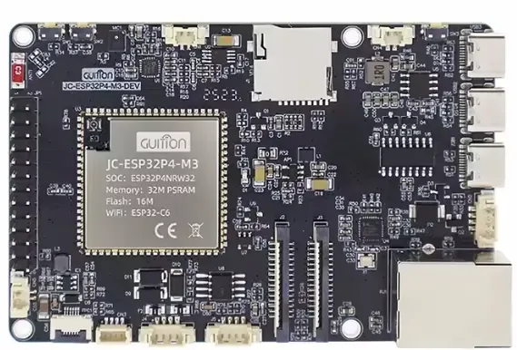

# ESP32 OT Security Assessment

[](https://github.com/il-prof-f-a/ESP32-OT-Security-Assessment/actions/workflows/host-tests.yml)
[](https://github.com/il-prof-f-a/ESP32-OT-Security-Assessment/actions/workflows/release.yml)

> **Latest release:** [v0.1.3 (prerelease) — firmware downloads, manifests and checksums](https://github.com/il-prof-f-a/ESP32-OT-Security-Assessment/releases/tag/v0.1.3)

Experimental ESP32 firmware for passive observation and authorized security assessment of operational-technology protocols. The project combines Ethernet/Wi-Fi connectivity, a management web interface, protocol discovery, passive IDS functions, controlled vulnerability checks and reporting for Modbus TCP, S7, PROFINET, OPC UA and EtherNet/IP.

> This project is still under test. Full intended functionality is not yet guaranteed. Use it only in laboratories or on systems you own or are explicitly authorized to assess. Never connect active assessment functions to a production OT network without a reviewed test plan.

## What the device does

ESP32 OT Security Assessment is a compact, laboratory-oriented appliance for observing OT traffic, documenting assets and executing explicitly authorised security-assessment workflows. Ethernet is the assessment interface. Where the board can support it, Wi-Fi is reserved for management so the operator can keep the management and OT networks separate.

The illustrated [web interface user guide](docs/user-guide/README.md) is the authoritative description of the interface. The scanner screenshots were refreshed from the experimental `v0.1.3` UI on 2026-08-29; labels, counters and example values can change.

| Capability                       | What it provides                                                                                                                                                      | Guide                                                                                                                                                                                                                                                     |
| -------------------------------- | --------------------------------------------------------------------------------------------------------------------------------------------------------------------- | --------------------------------------------------------------------------------------------------------------------------------------------------------------------------------------------------------------------------------------------------------- |
| Secure first boot and management | One-time setup, per-device credentials and TLS identity where supported, authenticated sessions, rate limiting and recovery controls.                                 | [Login and provisioning](docs/user-guide/login.md), [Security settings](docs/user-guide/security-settings.md)                                                                                                                                             |
| Management/OT separation         | A policy that keeps active assessment on Ethernet and, for Wi-Fi-capable targets, exposes management only through a non-overlapping Wi-Fi network.                    | [Network isolation](docs/security/network-isolation.md)                                                                                                                                                                                                   |
| Situational awareness            | Dashboard counters, audit evidence, device-presence tracking, memory diagnostics and a browser serial-reporting view.                                                 | [Dashboard](docs/user-guide/dashboard.md), [Audit manager](docs/user-guide/audit-manager.md), [Network presence](docs/user-guide/network-presence.md), [Diagnostics](docs/user-guide/diagnostics.md), [Serial monitor](docs/user-guide/serial-monitor.md) |
| Protocol discovery               | Targeted discovery for Modbus TCP, S7, PROFINET DCP, EtherNet/IP and OPC UA, plus ping, port and subnet discovery.                                                    | [Protocol discovery](docs/user-guide/protocol-discovery.md)                                                                                                                                                                                               |
| Passive detection                | IDS counters, signatures, alerting and protocol-aware visibility for the supported OT protocols. A zero-alert counter is not proof that a network is safe.            | [Intrusion detection](docs/user-guide/intrusion-detection-system.md), [CVE signatures](docs/user-guide/cve-signatures.md)                                                                                                                                 |
| Authorised active assessment     | Reusable vulnerability-scanner jobs, scheduled work and protocol fuzzing behind explicit controls and, when configured, a physical GPIO interlock.                    | [Vulnerability scanner](docs/user-guide/vulnerability-scanner.md), [Fuzzing](docs/user-guide/fuzzing.md), [Offensive-testing interlock](docs/security/offensive-testing-interlock.md)                                                                       |
| Reporting and evidence           | Filtered events and exports through serial, files, MQTT, webhooks, email and other configured channels; files and endpoint exports can contain sensitive information. | [Reporting](docs/user-guide/reporting.md), [Logging](docs/user-guide/logging.md)                                                                                                                                                                          |
| Network and device controls      | Network utilities, protocol configuration and GPIO-driven indicators or controls.                                                                                     | [Network tools](docs/user-guide/network-tools.md), [Protocol configuration](docs/user-guide/protocol-configuration.md), [GPIO reporter](docs/user-guide/gpio-reporter.md)                                                                                 |

> Active discovery, scanning and fuzzing can affect OT equipment. Use them only on systems you own or are explicitly authorised to assess, with a reviewed test plan and a bounded target scope.

## Hardware validation matrix

The four targets below are **test platforms**, not a claim of universal hardware support. “GPIO” means SoC GPIO count; usable breakout pins are lower because Ethernet, flash, PSRAM, boot straps and board peripherals reserve pins. “Internal memory / IRAM” deliberately reports the shared on-chip pool: IRAM is a build-time allocation from that pool, not a fixed board specification. Actual free IRAM, DRAM and PSRAM must be captured from the benchmark telemetry for a particular firmware revision.

| Test platform                                                                                                                                                                               | CPU                                     | GPIO                    | Internal memory / IRAM                    | PSRAM / flash | SD expansion                                | Current validation                                                                                                                     |
| ------------------------------------------------------------------------------------------------------------------------------------------------------------------------------------------- | --------------------------------------- | ----------------------- | ----------------------------------------- | ------------- | ------------------------------------------- | -------------------------------------------------------------------------------------------------------------------------------------- |
| [<br>LILYGO T-POE Pro](docs/hardware/lilygo-t-poe-pro.md)                                      | LX6 dual-core, 240 MHz                  | 34 SoC                  | 520 KB shared SRAM; build-dependent IRAM  | 8 MB / 16 MB  | No onboard slot confirmed                   | Firmware starts and operates in current tests. **HTTP only**.                                                                          |
| [<br>Waveshare ESP32-S3-ETH](docs/hardware/waveshare-esp32-s3-eth.md)              | LX7 dual-core, 240 MHz                  | 45 SoC                  | 512 KB shared SRAM; build-dependent IRAM  | 8 MB / 16 MB  | Onboard TF; unsupported in firmware         | Functional on a limited set of tested networks; no native 24 V input or GPIO screw-terminal block.                                     |
| [<br>Waveshare ESP32-P4-ETH](docs/hardware/waveshare-esp32p4-eth.md)               | RISC-V HP dual-core, 360 MHz            | 55 SoC / 27 header pins | 768 KB HP L2 + 32 KB LP + 8 KB TCM        | 32 MB / 32 MB | Onboard SDIO TF; unsupported in firmware    | Best current functional result; no Wi-Fi, so management uses the same Ethernet subnet.                                                 |
| [<br>GUITION JC-ESP32P4-M3-DEV](docs/hardware/guition-jc-esp32p4-m3-dev.md) | P4 RISC-V dual-core, 360 MHz + C6 Wi-Fi | P4 55 SoC               | Build-dependent P4 internal memory / IRAM | 32 MB / 16 MB | Onboard TF/SD; firmware integration pending | Functional in the current laboratory setup; requires the separately flashed C6 coprocessor image and broader network and soak testing. |

The SD-card work for persistent logs and an optionally encrypted preloaded configuration is tracked in [issue #22](https://github.com/il-prof-f-a/ESP32-OT-Security-Assessment/issues/22). It is not a current feature and no public release contains a deployment configuration or usable credential.

### Board profiles, photos and benchmark records

Each board profile contains the product facts, project pin assignment, power/programming notes, photos, pinout and a benchmark record. The current benchmark fields are intentionally empty until the firmware emits a reproducible telemetry record for node count, offered network load, analysed packets per second, drops, latency and memory use. Do not compare boards from UI counters alone.

- [LILYGO T-POE Pro profile](docs/hardware/lilygo-t-poe-pro.md)
- [Waveshare ESP32-S3-ETH profile](docs/hardware/waveshare-esp32-s3-eth.md)
- [Waveshare ESP32-P4-ETH profile](docs/hardware/waveshare-esp32p4-eth.md)
- [GUITION JC-ESP32P4-M3-DEV profile](docs/hardware/guition-jc-esp32p4-m3-dev.md)
- [Hardware image attribution](docs/assets/hardware/SOURCES.md)

## Quick installation

Requirements are Git, Python 3.10 or newer, and either Visual Studio Code with the
[PlatformIO extension](https://marketplace.visualstudio.com/items?itemName=platformio.platformio-ide)
or a terminal. Clone recursively because the project contains required submodules:

```bash
git clone --recurse-submodules https://github.com/il-prof-f-a/ESP32-OT-Security-Assessment.git
cd ESP32-OT-Security-Assessment
```

The setup helpers create a local Python environment and install the pinned build tools:

```powershell
powershell -ExecutionPolicy Bypass -File scripts/setup_platformio.ps1
```

```bash
./scripts/setup_platformio.sh
```

Open this repository folder in VS Code after setup. PlatformIO should show these environments:
`t-poe-pro`, `esp32-s3-eth`, `waveshare-esp32p4-eth`, and
`guition-jc-esp32p4-m3-dev`.

## Build, upload and monitor

Build any target from the PlatformIO sidebar or a terminal:

```powershell
pio run -e t-poe-pro
pio run -e esp32-s3-eth
pio run -e waveshare-esp32p4-eth
pio run -e guition-jc-esp32p4-m3-dev
```

Example upload and serial monitor on Windows:

```powershell
pio run -e t-poe-pro -t upload --upload-port COM10
pio device monitor --port COM10 --baud 115200
```

The wrappers combine build, upload and monitor while accepting a target and serial port:

```powershell
scripts/build_flash.ps1 -Target t-poe-pro -Port COM10
```

```bash
./scripts/build_flash.sh t-poe-pro /dev/ttyUSB0
```

If automatic reset fails, hold the board's BOOT button, start upload, release BOOT when esptool connects, and then reset the device. This is the board's bootloader mode.

On Windows, a checkout path without spaces is recommended for fully byte-for-byte reproducible images. The build still removes local user-profile paths when the repository is under a path with spaces; it filters only compiler prefix-map entries that the current PlatformIO/GCC response-file chain cannot forward correctly on Windows.

### Explicit esptool workflow

The helper builds and writes the bootloader, partition table and application with the correct chip and flash settings. By default it deliberately preserves NVS and LittleFS, including the active configuration and the generated TLS identity:

```powershell
python scripts/flash_esptool.py --target t-poe-pro --port COM10
```

For a clean installation after `--erase-flash`, the helper also writes the public LittleFS seed image automatically. To deliberately replace LittleFS during another operation, add `--include-filesystem`; this removes the current device configuration and TLS identity.

The current ESP32 layout uses bootloader `0x1000`, partition table `0x8000`, and application `0x200000`; ESP32-P4 uses a different bootloader offset. Do not copy offsets or flash-mode values between boards. `flasher_args.json` and each release manifest are authoritative.

The Guition board also requires its matching ESP32-C6 coprocessor image. Power/program the P4 via the USB port nearest RJ45, then connect a CH340-class adapter to the C6 UART using **TX → `C6_U0RXD`, RX → `C6_U0TXD`, GND → GND only**. Leave the adapter's 3.3 V and 5 V wires disconnected.
Build and flash the two chips through explicitly identified, different serial ports:

```powershell
./scripts/guition_two_chip.ps1 -P4Port COM10 -C6Port COM12 -FlashC6 -FlashP4
```

See the [GUITION two-chip guide](docs/installation/guition-two-chip.md) before connecting either
programming interface.

### ESP32-P4 build paths

The VS Code/PlatformIO environment is fully supported by this repository:

```powershell
pio run -e waveshare-esp32p4-eth
pio run -e guition-jc-esp32p4-m3-dev
```

It pins the tested `pioarduino/platform-espressif32` revision because stock PlatformIO does not yet provide the required ESP32-P4 toolchain mapping. A native ESP-IDF 5.5 build remains available:

```bash
IDF_TARGET=esp32p4 idf.py -B build/waveshare-esp32p4-eth -D ESP32_OT_BOARD=waveshare-esp32p4-eth build
```

The supplied P4 configuration targets pre-v3 ESP32-P4 silicon. Verify the chip revision before using it on newer hardware.

## First-boot provisioning

Release builds are deterministic and contain no administrator password, setup password, private key or machine-specific path. Every erased device running a release image creates its own one-time setup session at first boot (see "Embedded config" below for the local-build alternative).
Keep the serial console private: it is the only place where the temporary setup token, temporary AP password and HTTPS fingerprint are displayed.

- T-POE Pro and ESP32-S3-ETH start a WPA2 setup AP named from the device MAC. Connect one client, open the address printed on UART, and enter the setup token in the page. T-POE uses HTTP; S3 uses HTTPS.
- ESP32-P4-ETH starts Ethernet with DHCP. Find the HTTPS address and certificate fingerprint on UART and connect from the same Ethernet subnet.
- GUITION uses the separately flashed C6 for its Wi-Fi setup and management path. It never falls back to Ethernet; if C6/Wi-Fi is unavailable, management remains unavailable. This behavior has been checked on the laboratory board but requires wider network and soak testing.
- Set a unique administrator password of at least 16 bytes and select the network settings. Five invalid token attempts in one minute lock setup for 60 seconds. The session expires after 15 minutes.
- For S3/P4, compare the browser certificate's SHA-256 fingerprint with UART before submitting.
- A successful submission stores only a PBKDF2-HMAC-SHA-256 password hash, persists the config and per-device TLS identity, marks provisioning complete last, and reboots into operational mode.

There is no shared default password and no universal recovery credential. A new clone does not create a local credential file; secrets are generated independently on each physical device.

### Embedded config (local builds)

Local VSCode/PlatformIO builds self-provision with a fixed administrator password instead of the setup portal: platformio.ini carries -DESP32_OT_EMBEDDED_CONFIG=1 in every environment.

- The first build with the flag enabled creates a gitignored device-config.json in the repository root with a random administrator password. Edit that file to set your own password (at least 16 bytes); the firmware embeds only the PBKDF2 hash, never the plaintext.

- Optionally override any setting (static Ethernet IP, IDS thresholds, plugin options, ...): the file is deep-merged over the defaults, so a present key replaces the default and an absent key keeps it. Example device-config.json for a static address (useful for the Ethernet-only P4):

      {
        "admin_password": "your-fixed-password-here",
        "network": {
          "ethernet": {
            "dhcp": false,
            "ip": "192.168.1.253",
            "gateway": "192.168.1.1",
            "netmask": "255.255.255.0"
          }
        }
      }

  See CONFIG.md for the full schema and default values, and device-config.json.example.

- At first boot the device writes the hash and this configuration, marks provisioning complete and starts directly in operational mode (no setup AP, token or portal).

- To build the interactive-provisioning firmware locally instead, remove the
  -DESP32_OT_EMBEDDED_CONFIG=1 flag from the environment, or set the environment variable to 0:

      $env:ESP32_OT_EMBEDDED_CONFIG = "0"
      pio run -e t-poe-pro

- To change an embedded password or network later, edit device-config.json, rebuild, then factory-reset the device so it re-provisions with the new values.

#### TLS certificates (optional, internal builds only)

By default S3/P4 generate a unique self-signed certificate at first boot and store it on the device (LittleFS, at /data/certs/server.crt and /data/certs/server.key). For a single lab device you can instead seed a fixed certificate so the browser stops warning: create data/certs/server.crt and data/certs/server.key in the repository (they are gitignored via *.crt and *.key). Build and write that seed only with `python scripts/flash_esptool.py --target <target> --port <port>
--include-filesystem`; a normal firmware update preserves the existing on-device identity. The key must match the certificate; an invalid pair is discarded and regenerated.

Release/CI builds always use interactive provisioning: the workflow forces the flag to 0, so downloadable firmware never contains an embedded password.

> Security: embedded config bake a fixed credential into the firmware image, so anyone who extracts the binary can recover the hash and attempt offline cracking. Use this mode only for internal or lab devices whose password must be documented.

## Recovery and updates

The authenticated `POST /api/config/reset` operation performs a factory reset: it clears the completion marker first, removes configuration, administrator/security state and TLS material, then reboots into a new setup session.

If the administrator password is lost, use physical serial recovery. The command displays the chip, port and exact NVS/LittleFS regions and requires typing `RESET`:

```powershell
python scripts/flash_esptool.py --target t-poe-pro --port COM10 --factory-reset
```

To erase the complete chip without installing firmware, use the separate `--erase-all` option. For a complete factory installation, `--erase-flash` erases the chip before writing firmware and the public LittleFS seed image.

An app-only release image updates the application and preserves NVS, LittleFS configuration and the TLS identity. A factory image is for clean installation, requires a full erase, and contains all flash entries from the build manifest.

## Downloading verified releases

Each prerelease contains four primary assets per target:

- `esp32-ot-security-<target>-v<version>-factory.bin`
- `esp32-ot-security-<target>-v<version>-app.bin`
- `esp32-ot-security-<target>-v<version>-flash-bundle.zip`
- `esp32-ot-security-<target>-v<version>-manifest.json`

It also contains `SHA256SUMS.txt` and GitHub build-provenance attestations. Verify downloads before flashing:

```bash
sha256sum -c SHA256SUMS.txt
```

The manifest records the target chip, flash mode/size, every offset and every SHA-256 digest. The ZIP contains the individual flash files and manifest for advanced esptool use.

The Guition release additionally contains board-prefixed ESP32-C6 app/factory images and raw flash entries. Its manifest records the mandatory ESP-Hosted `3.0.6` / ESP-IDF `5.5.3` pairing and C6 offsets. Packaging fails rather than publishing a Guition P4 image without its matching C6 image.

## Testing

Run host-side tests and the release secret gate:

```powershell
python -m unittest discover -s tests -p "test_*.py" -v
python scripts/check_release_secrets.py --repository .
```

Firmware/build changes must compile all four PlatformIO environments and the Guition C6 project. Hardware claims must state the exact board, network topology and firmware revision used.

## Repository layout

```text
.github/                    CI, release automation and issue templates
boards/                     Custom PlatformIO board definitions
components/                 ESP-IDF components and submodules
data/                       Seed content for the LittleFS image
docs/assets/hardware/       Board photos, pinouts and attribution
scripts/                    Setup, build, flashing, packaging and security tools
src/                        Firmware source and embedded web UI
tests/                      Offline host-side tests
```

## Security and licensing

Read [SECURITY.md](SECURITY.md) before reporting a vulnerability and [CONTRIBUTING.md](CONTRIBUTING.md) before proposing a change. This is source-available research
software under the [PolyForm Noncommercial License 1.0.0](LICENSE.md), not OSI-approved open-source software. Third-party components and hardware images retain their respective rights and licenses.
