# Packet and frame analysis flow

This page documents how an Ethernet frame becomes a `NetworkPacket`, how the central IDS and
signature detector are invoked, and how each protocol plugin receives the packet. It also shows
how protocol discovery temporarily enables its own response-consumption window without coupling
that window to the global IDS switch.

- [Mermaid source](packet-analysis-flow.mmd)
- [Protocol Discovery guide](../user-guide/protocol-discovery.md)
- [Security and offensive-testing interlock](../security/offensive-testing-interlock.md)

## Reading the diagram

### 1. Layer-2 and Layer-3 ingress

`EthL2Adapter` accepts frames from either the ESP32-P4 L2-TAP path or the legacy Ethernet input
callback. `l2tapInputTrampoline()` first lets `esp_vfs_l2tap_eth_filter_frame()` consume the
configured PROFINET DCP EtherType. Non-DCP frames are observed before they are forwarded to
`esp_netif_receive()`. DCP frames read by `tapTask()` and frames received through
`input_trampoline()` use the same `EthL2Adapter::dispatchFrameToEngine()` helper. The helper
validates the complete Ethernet header and passes only a synchronous, bounded view to
`NetworkEngine`.

### 2. Normalization and queueing

`NetworkEngine::ingestL2()` copies the frame payload into its PSRAM ring, handles VLAN tags,
parses IPv4/TCP/UDP headers and infers `ProtocolType` (including PROFINET DCP/LLDP). IP-only
sources use `ingestIP()`. The capture side signals `sem_items_`; `NetworkEngine::anaLoop()` removes
one slot, invokes the registered callbacks, then releases the slot. A full ring increments the
drop counter instead of retaining a driver-owned buffer.

### 3. Central processing (exactly once per dispatched packet)

The callback registered in `src/main.cpp` performs the cross-protocol work in a fixed order:

1. `NetworkPresenceTracker::trackPacket(pkt)` runs once when `ids.network_presence.enabled` is true. It learns and inventories traffic; Presence alone never grants an IDS writer bypass.
2. `IntrusionDetectionGeneral::onPacket(pkt)` runs once when `ids.general.enabled` is true.
3. `SignatureDetector::analyzePacketWithReport()` evaluates signatures when `ids.signatures.enabled` is true and emits a structured threat event on a match.
4. `PluginManager::findByProtocol(pkt.proto)` selects the protocol plugin, if one is registered.

Consequently, the three passive modules can be toggled independently, disabling a protocol plugin cannot accidentally disable their global paths, and a plugin cannot invoke the global IDS or global Presence a second time.

### 4. Base-plugin template method

`BasePlugin::onPacket()` and `BasePlugin::doPacketAnalysis()` are `final`. The base implementation
therefore applies the same ordering to every plugin:

| Gate or method | Meaning |
| --- | --- |
| `isTargetPacket(pkt)` | Protocol-specific predicate used for writer authorization and the IDS hook. |
| `isIdsAnalysisEnabled()` | Reads the global IDS configuration for the plugin instance. |
| `doPacketIDSAnalysisOfProtocol(pkt)` | Abstract hook implemented by Modbus TCP, S7, PROFINET, OPC UA and EtherNet/IP. It contains only protocol IDS behavior. |
| `isDiscoveryActive()` | Per-protocol discovery state; it is independent of the global IDS switch. |
| `acceptsDiscoveryPacket(pkt)` | Optional protocol predicate for packets that may satisfy the active discovery transaction. |
| `beginDiscoveryPacket()` / `endDiscoveryPacket()` | In-flight counter protecting the discovery response window. |
| `processDiscoveryOfProtocol(pkt)` | Discovery hook. The default implementation is a no-op, so an inactive or unsupported discovery cannot affect IDS processing. |

Writer authorization remains in `onPacket()` and is evaluated only for packets classified as
writer packets. It is not reused as a discovery gate.

### 5. Discovery lifecycle and responses

Each protocol starts discovery by calling `BasePlugin::beginDiscovery()`, which returns the
move-only RAII `DiscoveryScope`. The scope sets that plugin's discovery state to active while
the protocol task sends probes. Responses return through the same ingress and dispatch pipeline;
the base template routes them to `processDiscoveryOfProtocol()` only while the corresponding
scope is active. On scope destruction, discovery is disabled and the base waits until all
in-flight response handlers have completed. `PROFINETPlugin::discovery_transaction_mutex_`
additionally prevents overlapping DCP transactions.

## Observable outputs

- IDS, signature and discovery events are serialized by `ReportingEngine` and audited by
  `AuditManager` according to the configured channels.
- Protocol hooks can update `FlowTable`, `SessionStateMachine` and protocol metrics.
- The web API, dashboard and serial monitor consume those structured events and metrics; they do
  not bypass the packet-dispatch contract.

## Invariants for future plugins

- Do not override `BasePlugin::onPacket()` or `BasePlugin::doPacketAnalysis()`.
- Put protocol IDS logic in `doPacketIDSAnalysisOfProtocol()`.
- Put discovery response parsing in `processDiscoveryOfProtocol()` and bracket active discovery
  with `beginDiscovery()`.
- Keep raw-frame ownership inside the ingress adapter; `NetworkEngine` must receive a copy.
- Register one plugin per `ProtocolType`; duplicate registrations are rejected by
  `PluginManager`.
