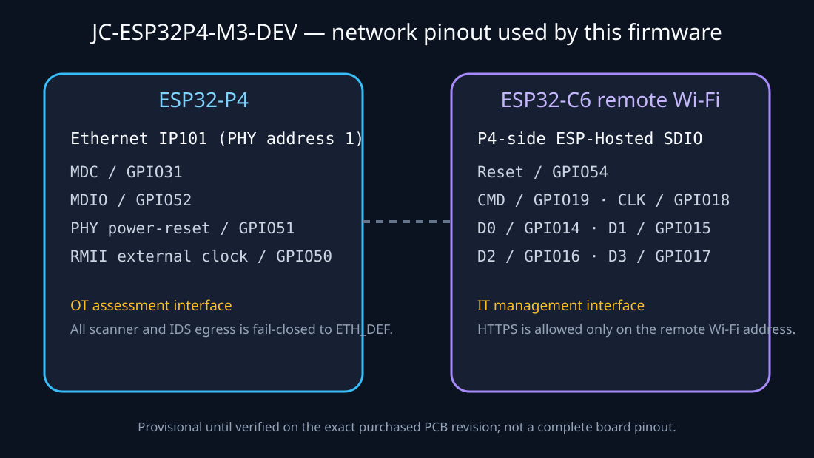
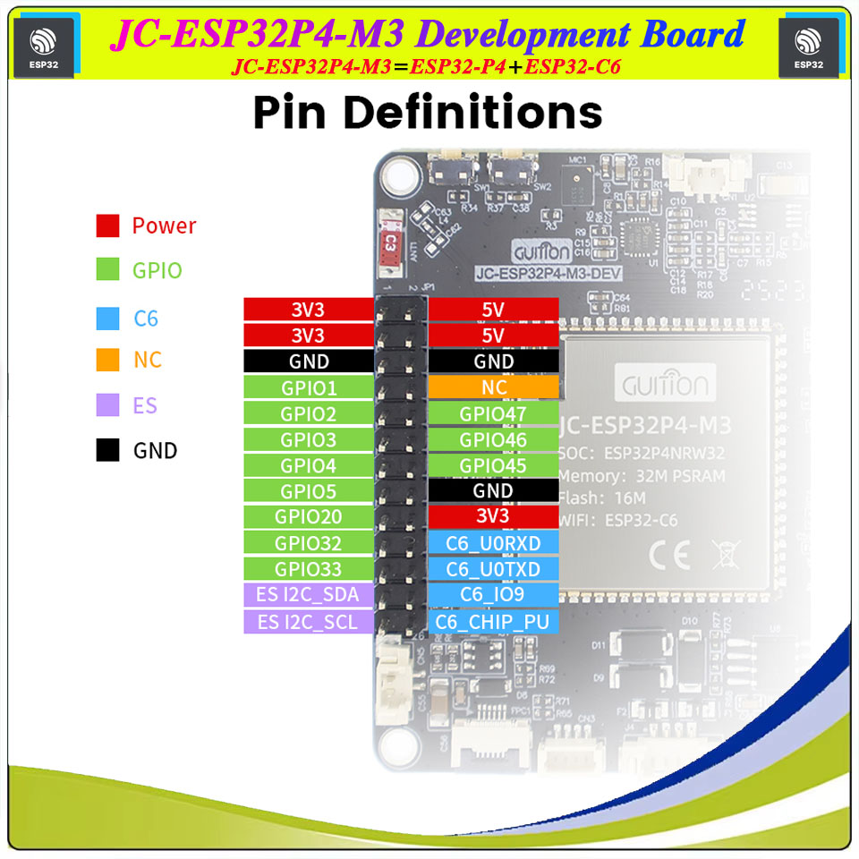

# GUITION JC-ESP32P4-M3-DEV

> Status: **experimental, initially hardware-validated**. Initial boot, Ethernet, C6 Wi-Fi, management isolation and provisioning checks have passed on the laboratory board. Broader network compatibility, failure recovery and soak testing remain open.

The board combines an ESP32-P4, 32 MB package PSRAM, 16 MB NOR flash, an IP101 100 Mbit/s Ethernet PHY, and an ESP32-C6 radio connected through SDIO. In this project the P4 runs the security-assessment firmware while the C6 runs the pinned ESP-Hosted `3.0.6` coprocessor image.

## Hardware summary

| Property                     | Documented value                                                 | Project relevance                                                                                                                                                                                                                                                                      |
| ---------------------------- | ---------------------------------------------------------------- | -------------------------------------------------------------------------------------------------------------------------------------------------------------------------------------------------------------------------------------------------------------------------------------- |
| Main processor               | ESP32-P4 dual-core 32-bit RISC-V, up to 360 MHz                  | Runs the security-assessment application and Ethernet data path.                                                                                                                                                                                                                       |
| Radio coprocessor            | ESP32-C6 over SDIO                                               | Runs the separately built, version-pinned ESP-Hosted Wi-Fi image.                                                                                                                                                                                                                      |
| SoC GPIO                     | 55 P4 GPIO; the project reserves Ethernet and C6 SDIO/reset pins | Free header availability must be confirmed against the actual board revision before adding a GPIO interlock or indicator.                                                                                                                                                              |
| Internal memory / IRAM model | P4 HP/LP internal-memory allocation is build-dependent           | Do not state a fixed IRAM figure. The benchmark must report measured free/minimum IRAM and DRAM for the exact P4 build.                                                                                                                                                                |
| PSRAM / flash                | 32 MB PSRAM / 16 MB NOR flash                                    | PSRAM is explicitly enabled by the project profile.                                                                                                                                                                                                                                    |
| Ethernet                     | IP101 PHY, 10/100 Mbit/s RMII                                    | Sole assessment interface.                                                                                                                                                                                                                                                             |
| Management radio             | ESP32-C6 Wi-Fi through ESP-Hosted                                | Wi-Fi-only management preserves the intended management/OT separation.                                                                                                                                                                                                                 |
| SD expansion                 | Onboard TF/SD interface (hardware support confirmed)             | The upstream schematic includes a dedicated TF-card section. The current project firmware does not mount or use it yet; SD logging and optionally encrypted preloaded configuration are planned in [issue #22](https://github.com/il-prof-f-a/ESP32-OT-Security-Assessment/issues/22). |

The upstream board materials confirm a TF/SD-card interface, but they do not make it a firmware feature of this project. Pin assignment, mounting, error recovery and secure handling of removable media must be implemented and validated before it is used for assessment logs or configuration data.

| Function            | P4 GPIO           | Firmware role                  |
| ------------------- | -----------------:| ------------------------------ |
| IP101 MDC           | 31                | Ethernet management data clock |
| IP101 MDIO          | 52                | Ethernet management data       |
| IP101 power/reset   | 51                | PHY enable/reset               |
| RMII external clock | 50                | Ethernet reference clock       |
| C6 reset            | 54                | ESP-Hosted coprocessor reset   |
| C6 SDIO CMD / CLK   | 19 / 18           | Remote Wi-Fi command and clock |
| C6 SDIO D0–D3       | 14 / 15 / 16 / 17 | Remote Wi-Fi data bus          |

The C6-side SDIO GPIO numbers differ from the P4-side numbers. Do not transpose them when building or debugging the coprocessor image.

## Programming and power connections

The board has two independently programmable chips and consequently needs two separate serial connections. The USB connection for the P4 and the external C6 UART adapter have different roles.

1. Connect the **USB port nearest the RJ45 Ethernet connector** to the host computer. This is the P4 programming UART and the board's power source during this procedure.

2. Connect a CH340-class USB-to-UART adapter to the C6-labelled header with the following three wires only:

   | USB-to-UART adapter | Board header | Purpose                 |
   | ------------------- | ------------ | ----------------------- |
   | TXD                 | `C6_U0RXD`   | C6 receive input        |
   | RXD                 | `C6_U0TXD`   | C6 transmit output      |
   | GND                 | GND          | Shared signal reference |

3. Leave the adapter's **3.3 V and 5 V/VCC pins disconnected**. The P4 USB connection already powers the board. Feeding power from the CH340 adapter can back-power the USB circuit and may damage the host USB port, the adapter or the development board.

`C6_IO9` is the C6 boot strap and `C6_CHIP_PU` is the C6 reset/enable signal. If the C6 does not enter download mode automatically, hold `C6_IO9` at GND, reset the C6 by pulling `C6_CHIP_PU` low and releasing it, then release `C6_IO9` after the uploader connects. Do not attach either of these signals to a power pin.

See the [two-chip flashing guide](../installation/guition-two-chip.md) for the command sequence.

## Network policy

- Assessment, discovery, fuzzing and IDS traffic is bound to `ETH_DEF` and fails closed when Ethernet has no address.
- Management is Wi-Fi-only through the ESP32-C6. The firmware does not fall back to Ethernet.
- Management is blocked when the Wi-Fi and Ethernet IPv4 ranges overlap.
- The HTTPS connection gate checks the accepted socket's local destination address. This prevents an application request through Ethernet, but the underlying wildcard listener may still answer a TCP SYN; see [Network isolation and residual exposure](../security/network-isolation.md).

## Benchmark record

No comparable benchmark has been published for this two-chip target yet. The initial validation covers boot, Ethernet, C6 Wi-Fi, isolation and provisioning; it does not establish a throughput or soak-test result.

| Required field                                  | Current record |
| ----------------------------------------------- | -------------- |
| P4 firmware release/commit and C6 image version | Not measured   |
| Test topology and Ethernet/Wi-Fi link details   | Not measured   |
| Number of emulated/observed OT nodes            | Not measured   |
| Offered network load and protocol packet mix    | Not measured   |
| Analysed packets per second and drop rate       | Not measured   |
| C6 SDIO/remote-Wi-Fi state during the run       | Not measured   |
| p50/p95 processing latency                      | Not measured   |
| Free/minimum internal DRAM, IRAM and PSRAM      | Not measured   |

The benchmark telemetry must record both image versions, SDIO state, Wi-Fi management state, Ethernet link state, queue drops and memory low-water marks. Results are comparable only when the same protocol mix, capture interval and reporting configuration are recorded.

## References and purchasing

- [GUITION manufacturer product page](https://www.guition.com/esp32p4-display-module/esp32p4-display-module)
- [GUITION English specification PDF](https://www.guition.com/icms/upload/fb081940d6fc11f09850077a33e1404f/file/productmanager-productfile/1d8749eb4c444726b7b85189aee66af3/Directory/JC-ESP32P4-M3-DEV%20Specifications-EN_1776241973799.pdf)
- [Community pinout and configuration reference](https://devices.esphome.io/devices/guition-esp32-p4-m3-dev/)
- [Upstream board examples and schematics](https://github.com/DRubioG/JC-ESP32P4-M3-DEV) (includes the TF-card schematic section)
- [Purchase listing for the documented model](https://www.aliexpress.com/item/1005009511796128.html)

Seller listings and PCB revisions can change without notice. Compare the silkscreen, flash size, PHY and SDIO wiring before flashing.
