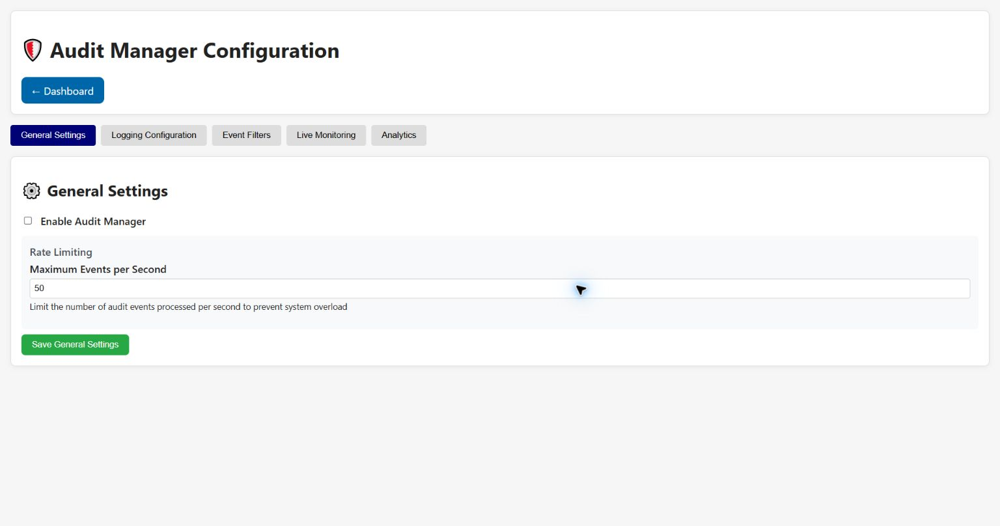

# Audit Manager Configuration

The Audit Manager records management and security-relevant events, applies event filters and
provides live and summary views. Its tabs separate configuration from monitoring.

## General Settings

**Enable Audit Manager** gates audit processing. **Maximum Events per Second** limits the audit
event rate so a burst cannot consume all reporting capacity. **Save General Settings** applies the
values.

## Logging Configuration

Independent switches select denied operations, security events, timeouts, rate-limit events,
system audit events and configuration changes. Disabling a category reduces evidence available
after an incident. **Save Logging Configuration** persists the selection.

## Event Filters

**Enable Event Filtering** applies include and exclude patterns. **Case Sensitive Matching**
changes pattern comparison. Include and exclude patterns are entered one per line; exclude rules
are useful for high-volume debug/heartbeat traffic, but an overly broad exclusion can hide an
important event. **Save Filter Settings** applies the lists.

## Live Monitoring

The live cards summarize denied operations, timeouts, rate limits and security events. **Refresh**
loads recent audit events, **Clear Log** removes the visible/stored audit log through its API, and
**Auto-refresh (5s)** periodically reloads the view. Export before clearing data needed for review.

## Analytics

Choose Last Hour, Last 24 Hours, Last 7 Days or Last 30 Days. The page presents event-type
distribution, top security events and an activity timeline. **Export Audit Data** downloads an
audit snapshot for offline analysis. Current analytics are experimental and depend on retained
event data.

[Back to the guide index](README.md)
