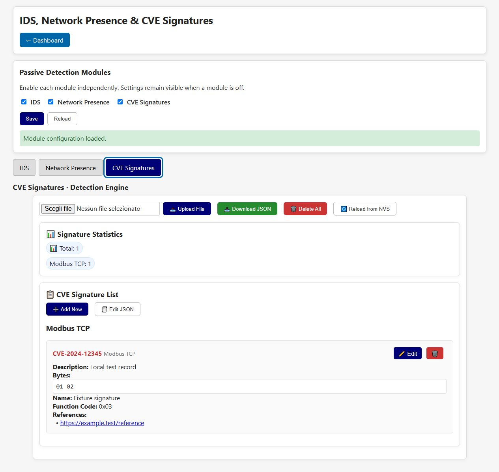

# CVE Signature Detection Engine

This page manages byte-pattern signatures used by the detection engine. A signature match is a
candidate indicator associated with a CVE; it is not proof that the observed device is vulnerable.

This panel belongs to the [shared passive detection page](passive-detection.md).
Its switch controls matching independently of IDS. Turning it off preserves the
database but disables panel controls. Management APIs remain available.
The screenshot uses simulated lab data from the local UI fixture.

## Database controls

- **Upload File** imports a JSON signature database.
- **Download JSON** exports the active database for review or backup.
- **Delete All** removes all signatures and should be used only after a backup.
- **Reload from NVS** discards unsaved browser state and reloads persisted signatures.
- **Signature Statistics** summarizes total signatures and their protocol grouping.

## Signature list and editor

Entries are grouped by protocol. **Add New** opens an empty editor; the row edit button changes an
entry and the trash button deletes it. **Edit JSON** exposes the raw database, and **Save JSON**
validates and persists that representation.

| Field | Meaning |
| --- | --- |
| **CVE ID** | Standard vulnerability identifier, such as `CVE-YYYY-NNNN`. |
| **Name** | Optional human-readable vulnerability name. |
| **Protocol** | Modbus TCP, PROFINET, S7comm/S7comm+, OPC UA or EtherNet/IP. |
| **Bytes (hex)** | Hexadecimal prefix/pattern compared with observed payload bytes. |
| **Function Code** | Optional protocol operation discriminator. |
| **Description** | Analyst context for the match. |
| **References** | One URL per line for authoritative advisories or research. |

Use **Save** to commit an edit and **Cancel** to close without applying it. Validate imported
signatures in a lab: overly short or generic byte patterns can generate many false positives.

[Back to the guide index](README.md)
