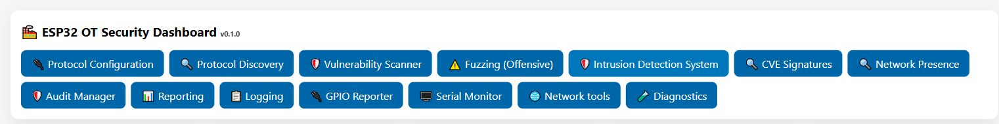

# ESP32 OT Security Dashboard

The dashboard is the operational home page. Its navigation buttons open the specialist pages,
while the cards below them combine live status, configuration, logs and shortcuts to selected
assessment functions.

## Status cards

| Card | What it indicates |
| --- | --- |
| **Status** | Firmware uptime, Ethernet and Wi-Fi addresses, observed packet count and alert count. **Refresh** reloads the values; **Reboot** restarts the device. |
| **Plugin** | Runtime state returned for each registered OT protocol plugin. The current experimental renderer may display `[object Object]`; use Protocol Configuration for authoritative settings. |
| **IDS** | Total packets processed, alert count and counters grouped by internal protocol identifier. Zero alerts means no rule has fired in the reported interval, not that the network is safe. |
| **Network Info** | Active Ethernet/Wi-Fi mode, link or connection state, addresses and whether STA or AP mode is active. |

## Configuration card

**Config (JSON)** displays the complete runtime configuration. It may contain Wi-Fi, reporting or
endpoint secrets, so never include it in public screenshots or support tickets.

- **Save** submits the edited JSON as a configuration update.
- **Save Complete** persists the complete document to non-volatile storage and the filesystem.
- **Export** downloads the current configuration. Store exports securely.
- **Import** uploads a JSON configuration for validation and application.
- **Load Embedded Config** restores the public configuration embedded at build time. It does not
  create an administrator credential and can replace operational settings.

## Log cards

- **System Logs** shows recent application log lines and downloads App, Network, Security or
  Access logs.
- **Event Logs** downloads reporter-specific files for fuzzing, IDS, vulnerability scanning,
  discovery, audit and GPIO events.
- **Access Log** refreshes HTTP/HTTPS request records used for management-interface auditing.

Downloaded logs can contain IP addresses, device names, requests and security events. Review and
redact them before sharing.

## Assessment shortcuts

- **Scanner Jobs** lists configured vulnerability jobs.
- **Protocol Discovery** starts Modbus, S7, PROFINET DCP, EtherNet/IP or OPC UA discovery with a
  target and timeout.
- **Fuzzing (safe mode)** creates, lists, starts and stops bounded fuzzing jobs. The protocol,
  target, rate and maximum case count define the job.
- **Advanced IDS Stats** refreshes live counters and clears only the browser-side charts.
- **Signatures DB** uploads or reloads the detection signature database.

## Output and policy shortcuts

- **Event Format** selects JSON, CEF, LEEF or CEE output.
- **Advanced IDS** loads and saves per-protocol packet-rate thresholds and the replay window.
- **Reporting** loads channel status or flushes queued events.
- **Reporting Endpoints** edits endpoint configuration and applies it.
- **Log Retention** controls directory, quota, age and cleanup interval; **Run now** immediately
  executes retention cleanup.

For safer, more complete editing, use the dedicated page linked by each navigation button.

[Back to the guide index](README.md)
