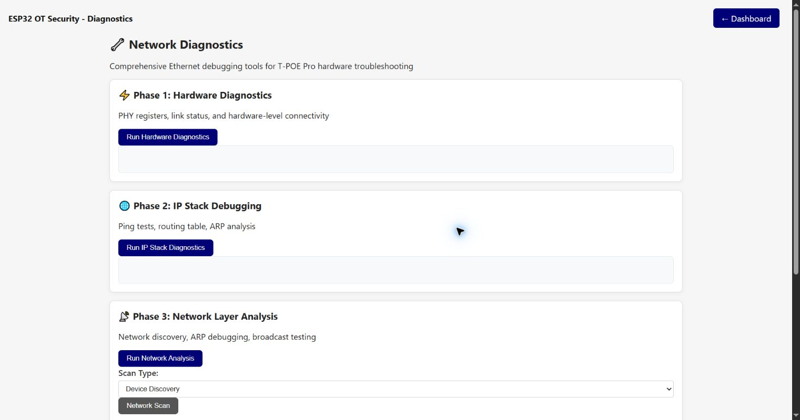

# Network Diagnostics — Phased Troubleshooting

This page runs structured Ethernet troubleshooting. Its current text is oriented toward T-POE Pro,
but the returned data depends on the selected board and driver.

## Phase 1: Hardware Diagnostics

**Run Hardware Diagnostics** reads hardware-level information such as PHY registers, link status
and low-level connectivity. Use it first when Ethernet does not establish link.

## Phase 2: IP Stack Debugging

**Run IP Stack Diagnostics** inspects IP-layer state such as addresses, routing, ARP and reachability
tests. Run it after physical link is present but communication still fails.

## Phase 3: Network Layer Analysis

**Run Network Analysis** collects discovery/ARP/broadcast information. **Scan Type** selects Device
Discovery or Segment Analysis, and **Network Scan** starts the selected operation. These functions
generate traffic and should be used only on an authorized segment.

## Phase 4: Driver Level Debugging

**Run Driver Diagnostics** reports driver and interface internals useful when hardware and IP
results disagree or the interface repeatedly resets.

## Quick Actions and summary

- **Run All Diagnostics** executes the phases as a combined troubleshooting sequence.
- **Clear Results** clears the displayed diagnostic output.
- **Export Results** downloads the collected data. It may contain internal network topology and
  should be treated as sensitive.
- **Diagnostics Summary** condenses phase outcomes into status indicators; inspect each phase's
  raw detail before drawing a conclusion.

Diagnostics observe and probe the interface but do not repair cabling, power, PHY configuration or
network policy. Use serial boot logs and the board schematic alongside these results.

[Back to the guide index](README.md)
