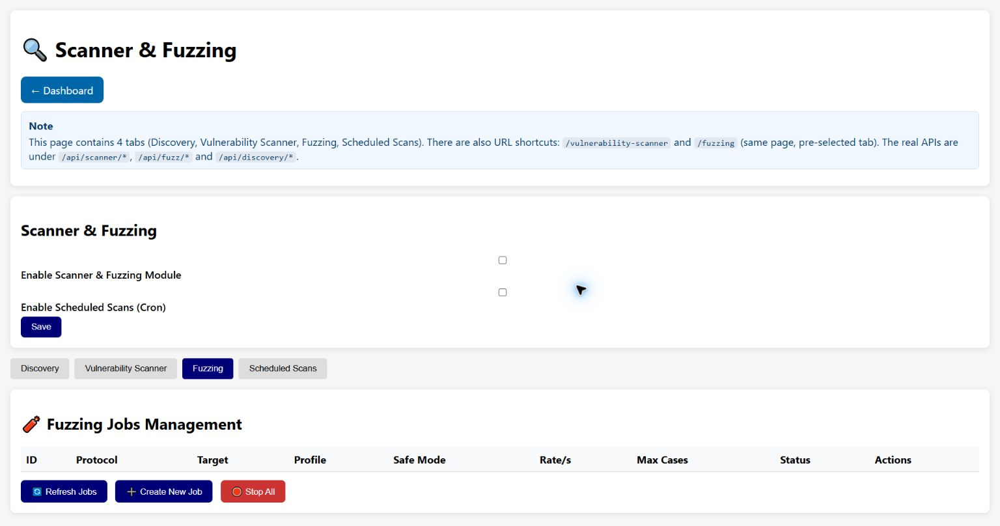

# Fuzzing

The Fuzzing tab creates and controls jobs that send varied or malformed protocol inputs. It is an
offensive feature and can stop, reconfigure or overload real equipment. Use it only in an isolated
lab or under a written, approved test procedure.

## Job list

The table shows job ID, protocol, target, selected profile, Safe Mode, rate, maximum cases, status
and actions. **Refresh Jobs** toggles/updates automatic refresh, **Create New Job** opens the form,
and **Stop All** requests every active fuzzing job to stop. Per-row actions run a job, display its
last JSON result, or delete it.

## Basic job fields

- **Protocol** selects the protocol engine and reveals protocol-specific controls.
- **Target** uses the format shown by the selected profile, commonly `host:port` and sometimes a
  unit identifier.
- **Rate (per second)** limits generated cases.
- **Max Test Cases** bounds total work.
- **Duration (ms)** adds a wall-clock bound.
- **Attack Profile** selects one or more implemented strategies. Profiles marked `(TODO)` are
  unavailable. A profile marked as requiring Safe Mode off is intentionally offensive.
- **Safe Mode** blocks write-oriented actions that could affect production state. Keep it enabled
  unless the test plan explicitly requires an offensive profile.

## Advanced Modbus controls

Critical-register lists keep special attention on selected addresses. Unit ID range defines the
tested devices, timing delay slows requests, stealth mode reduces the traffic pattern, discovery
depth expands preliminary enumeration, and Force Broadcast permits broadcast addressing. A
broadcast write can affect multiple devices and should normally remain off.

## Advanced S7 controls

Rack/slot and timeout select the PLC endpoint. Area, DB number, byte offset and hex value define an
S7 write. Control actions include STOP, cold restart and hot restart. Unauthorized write and PLC
control profiles require Safe Mode to be disabled; they can interrupt a process.

## Results and emergency stop

**Create Job** stores the definition but does not by itself prove safe execution. Review all
fields, then use the row Run control. **Operation Results** shows the last response and can export
JSON. Use **Stop All** if the target behaves unexpectedly, but do not assume a stop request can
undo a packet already transmitted.

[Back to the guide index](README.md)
