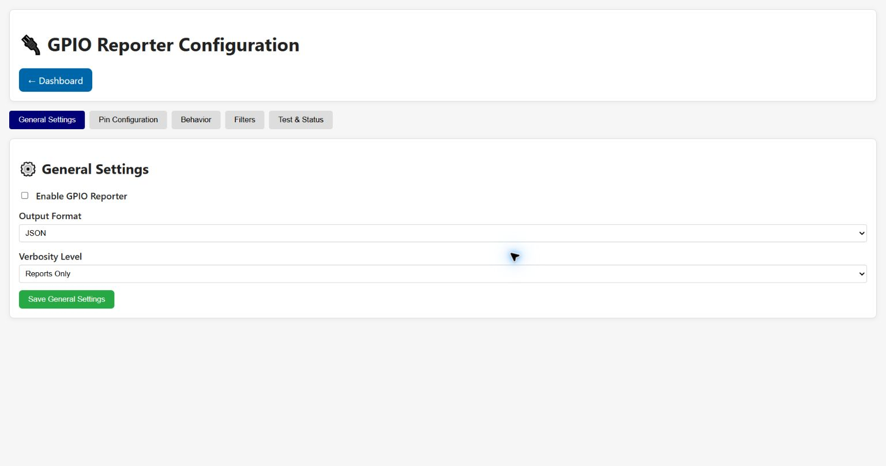

# GPIO Reporter Configuration

The GPIO Reporter maps security events to LEDs, a buzzer and physical buttons. Pin availability
and voltage levels vary by board; incorrect wiring can damage the ESP32 or connected equipment.

## General Settings

**Enable GPIO Reporter** activates the output. Select JSON, CEF or Plain Text format and Reports
Only, Verbose or Debug verbosity. **Save General Settings** applies the channel configuration.

## Pin Configuration

Assign critical, warning, info and success LEDs, a buzzer, and acknowledge/reset/learning/
maintenance buttons. The numeric value is the ESP32 GPIO number, not a connector position. Check
the board pinout, avoid reserved Ethernet/flash/boot pins and use appropriate drivers for loads.
**Save Pin Configuration** persists the map.

## Behavior

Enable or disable the critical-alert buzzer. Alert duration determines how long an indication
remains active, blink interval sets LED cadence, and debounce time filters mechanical button
bounce. **Save Behavior Settings** applies them.

## Filters

Enable filtering, select case sensitivity and enter include/exclude patterns one per line. Only
matching events are routed to GPIO after excludes are applied. Test filters with non-critical
events before relying on them.

## Test & Status

LED test buttons activate each color or turn all LEDs off. **Test Buzzer** activates the configured
buzzer. **Refresh Button Status** reads inputs and **Refresh Status** reloads reporter state. These
controls operate physical outputs immediately; disconnect actuators that could trigger machinery.

[Back to the guide index](README.md)
