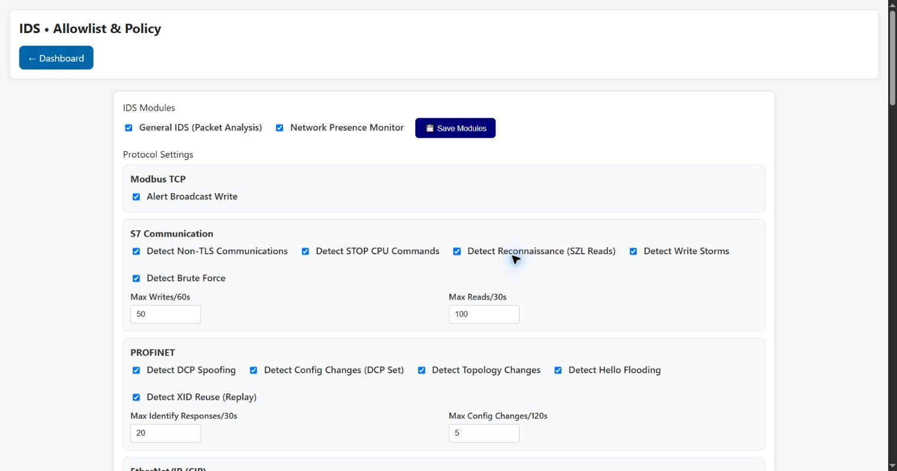

# IDS • Allowlist & Policy

This page configures passive packet-analysis modules, protocol-specific detection rules and the
source allowlist. It also displays learned devices and rule statistics.

## IDS modules and protocol rules

**General IDS (Packet Analysis)** enables the common packet pipeline. **Network Presence Monitor**
enables learning/trust analysis. **Save Modules** applies these switches.

- **Modbus:** alert on broadcast writes.
- **S7:** detect non-TLS communication, STOP CPU commands, SZL reconnaissance, write storms and
  brute-force patterns. Max writes/60 s and reads/30 s are rate thresholds.
- **PROFINET:** detect DCP spoofing, DCP Set/configuration changes, topology changes, Hello floods
  and XID reuse/replay. Thresholds limit Identify responses and configuration changes.
- **EtherNet/IP:** detect session flooding, SendRRData storms, CIP write storms, reconnaissance
  and error patterns, with separate event-window thresholds.

**Save Protocol Settings** persists these rule choices.

## Allowlist behavior

**Allowlist active** enables matching. The default action applies when a source is not matched:

- **Alert** logs and continues processing.
- **Drop** attempts to block and log.
- **Ignore** applies no special allowlist logging.

Global IP entries accept IPv4 or CIDR. MAC entries accept complete addresses or documented
wildcards. Per-protocol rules can be added from the catalog or manually and have their own IP/MAC
entries. **Reload** discards local edits and reloads the device, **JSON** previews the document,
**Cancel** reverts browser-side edits, and **Save** writes the policy.

Broad entries such as an all-address CIDR effectively defeat source restriction. Validate changes
with **Quick test – sample IP/MAC** before saving.

## Statistics and learned devices

**Refresh** updates match/action counters. The learned-device list can be refreshed, promoted to
permanent trust, removed, or cleared. Clearing learned data is destructive and can cause known
devices to be classified as new until they are observed again.

[Back to the guide index](README.md)
