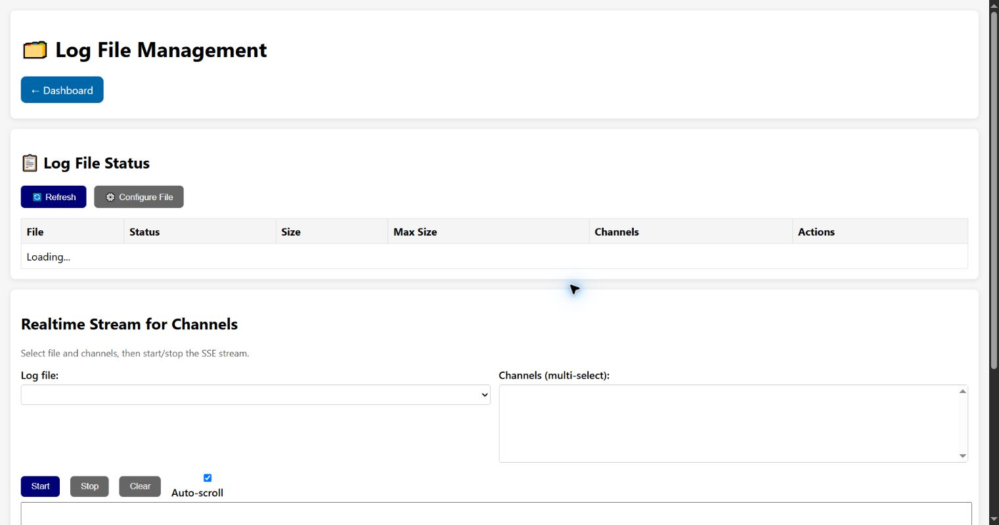

# Log File Management

This page shows managed log files, edits rotation limits and streams selected channels in real
time. It is also the authoritative index of the files exposed by the firmware's action logging
policy.

## Action log files

New events are routed to dedicated files so a discovery result is not mixed with an offensive scan:

| File | Contents | Format |
| --- | --- | --- |
| `discovery_events.log` | General and protocol discovery results | Structured JSON |
| `vulnerability_scanner.log` | Vulnerability scanner lifecycle, test and result events | Structured JSON |
| `signature_events.log` | Signature/CVE detections, including the captured packet buffer when available | Structured JSON |
| `network_presence_events.log` | Device observation and trust-state transitions | Structured JSON |
| `audit_events.log` | Denials, timeouts, configuration/security actions | Timestamped classic text lines |
| `gpio_events.log` | GPIO reporter input/output actions and mapped controls | Timestamped action records |

`scanner_events.log` remains readable as a legacy mixed-history file, but new discovery and
vulnerability events are not routed there. Every record carries `timestamp_ms` or a formatted
date/time. Before NTP/HTTP time synchronization, the line format explicitly says `(boot time)`;
that value is monotonic uptime and must not be interpreted as UTC.

## Log File Status

The table reports file name, enabled/disabled state, current size, maximum size, routed channels
and actions. **Refresh** reloads the table. Row actions exposed by the runtime can download a file
or enable/disable it. Logs may contain internal addresses, device identifiers and security events;
redact before sharing.

## Configure File

Select a managed file, then configure:

- **Enabled** to permit writes;
- **Max Size (KB)** before rotation;
- **Max Backup Files** retained after rotation;
- **Channels** as a comma-separated routing list.

**Save** applies the file configuration. **Cancel** closes the modal without applying browser
edits. Small limits can rotate evidence too quickly; large limits consume LittleFS capacity.

## Realtime Stream for Channels

Select a log file and one or more channels. **Start** opens the server-sent-event stream, **Stop**
closes it, **Clear** empties only the browser output, and **Auto-scroll** keeps the newest event in
view. Streaming can be verbose and should not be left open unnecessarily on constrained devices.

[Back to the guide index](README.md)
