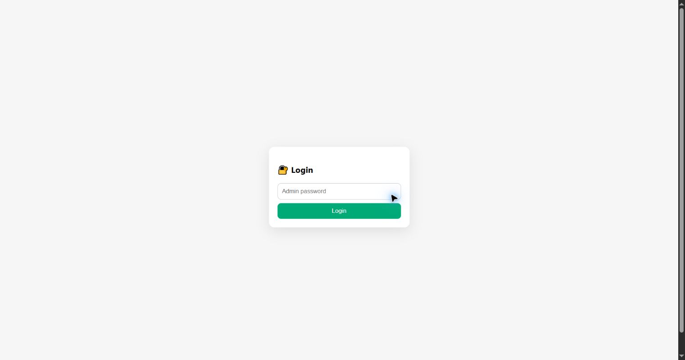

# Login

The Login page authenticates an administrator before exposing the operational management interface. Enter the administrator password created during first-time provisioning and select **Login**.

## Fields and controls

| Item               | Meaning                                                                                                                               |
| ------------------ | ------------------------------------------------------------------------------------------------------------------------------------- |
| **Admin password** | The per-device administrator password. The firmware verifies its PBKDF2 hash; the public firmware has no universal default password.  |
| **Login**          | Sends the password to the authentication endpoint. On success, the device creates the single active web session and redirects to the dashboard. |

The resulting URL contains a `sid` parameter. The UI propagates this session identifier to page links and uses it to authorize API calls. Treat it like a password: do not share the URL.

Only one web session token is valid on a device at a time. A successful login immediately revokes the previous token, including tokens held by another browser or tab. The token is held only in volatile memory, is not written to NVS, and is revoked when the web server stops or the device reboots. Every authenticated page or API request refreshes the inactivity timer; after 600 seconds without an authenticated request, the token expires and the next page request is redirected to Login (API requests receive HTTP 401).

API keys are separate credentials and are not revoked when the administrator web session rotates. The existing `sid` query-string transport is retained for compatibility, so avoid bookmarking or sharing authenticated URLs and use the Logout action when one is provided by the client.

## If login fails

- Confirm that the device has completed provisioning and has rebooted into operational mode.
- Check that you are using the correct management address and transport for the board.
- Re-enter the password manually instead of relying on an old browser value.
- A client may be temporarily rate-limited after repeated authentication failures. Wait for the
  configured block period or use the Security Settings page from another authorized session.
- If the password is lost, use the documented physical factory-reset procedure. There is no
  password-recovery backdoor.

[Back to the guide index](README.md)
