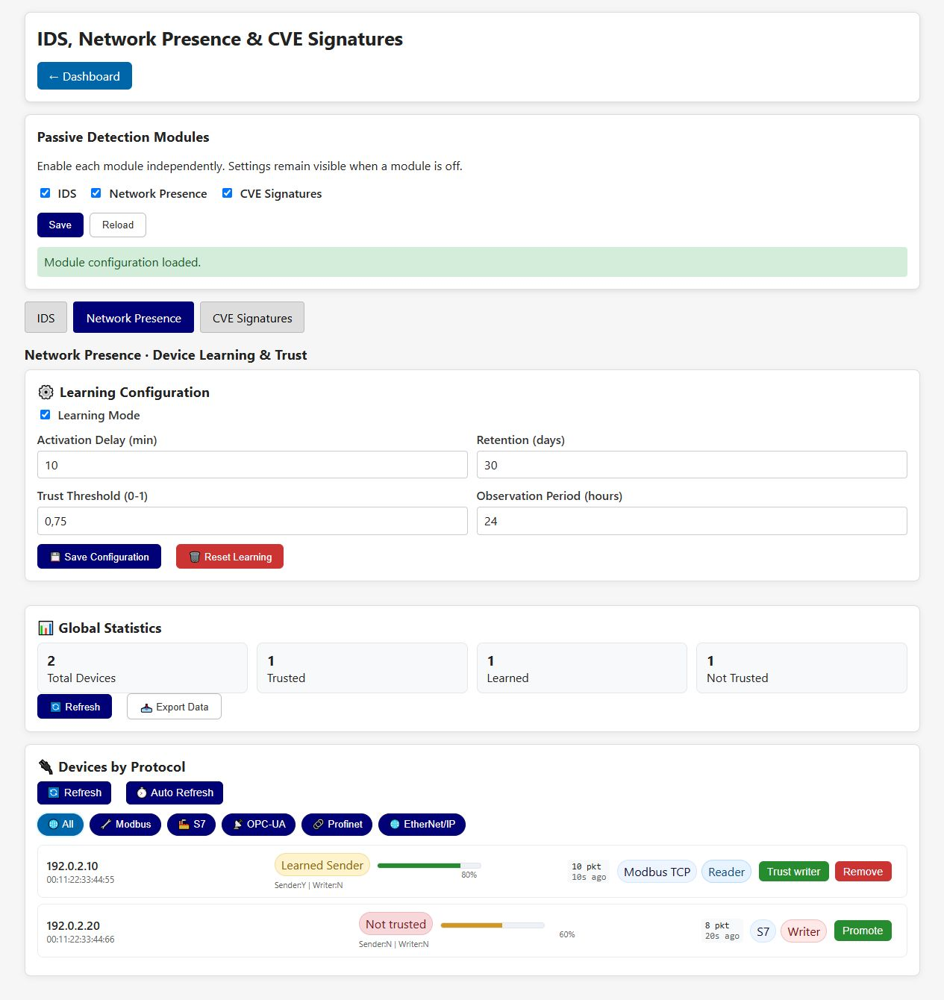

# NetworkPresence • Device Learning & Trust

NetworkPresence learns devices from observed protocol traffic and assigns trust based on the
configured observation policy. It supports inventory and change detection; it is not an identity
or cryptographic authentication system.

This panel belongs to the [shared passive detection page](passive-detection.md).
It learns independently of IDS, without granting a writer bypass while IDS is off.
The screenshot uses simulated lab data from the local UI fixture.

## Learning configuration

- The shared **Network Presence** switch activates tracking; **Save** applies it without rebooting.
- **Learning Mode** allows new observations to contribute to the learned baseline.
- **Activation Delay** delays enforcement after startup or activation.
- **Retention** controls how long learned observations are kept.
- **Trust Threshold (0–1)** is the score required for trusted classification.
- **Observation Period** is the minimum history used before classification.
- **Save Configuration** persists and applies these values without rebooting.
- **Reset Learning** deletes learned-device state. Export first if the baseline matters.

## Global statistics

**Total Devices** is the number currently known. **Trusted**, **Learned** and **Not Trusted** split
that population by current classification. **Refresh** reloads counters; **Export Data** downloads
the presence dataset for offline analysis.

## Devices by protocol

Tabs filter All, Modbus, S7, OPC UA, PROFINET or EtherNet/IP observations. **Refresh** reloads the
table and **Auto Refresh** toggles periodic updates. A device row may expose **Promote** to make
trust permanent and **Remove** to demote or remove trust.

Trust scores are influenced by continuity, protocol diversity and observation frequency. A high
score means behavior is consistent with the learned baseline, not that the device is uncompromised.
Review unexpected changes against maintenance records and asset inventory.

[Back to the guide index](README.md)
