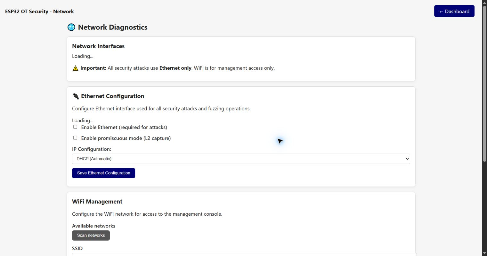

# Network Diagnostics

The Network Tools page displays interface state, configures Ethernet/Wi-Fi management and runs a basic ping test. It also states the intended separation: active security assessment traffic uses Ethernet, while Wi-Fi is for management on Wi-Fi-capable targets.

## Network Interfaces

The runtime panel shows each available interface and its current state. A configured interface may still have no link or address. ESP32-P4 has no Wi-Fi, so Wi-Fi controls are not applicable there.

## Ethernet Configuration

- **Enable Ethernet** gates the interface used by capture and active assessment functions.
- **Promiscuous mode** enables Layer-2 capture needed by passive observation features.
- **DHCP** obtains address settings automatically.
- **Static IP** reveals address, netmask, gateway and DNS fields.
- **Save Ethernet Configuration** validates and stores the values.

The page warns when a restart is required. Changing the management-facing interface can make the current page unreachable; record the new address and perform changes from a recoverable location.

## Wi-Fi Management

**Scan networks** starts an asynchronous Wi-Fi scan and updates the available-network list. Select or enter the SSID, enter its password, then choose **Save WiFi configuration**. The page reports connection progress and the new address. Wi-Fi credentials are secret and must never be committed to the repository or included in screenshots.

On LILYGO T-POE Pro, Wi-Fi management uses HTTP because HTTPS is currently unstable. On ESP32-S3-ETH, use Wi-Fi management to preserve separation from the Ethernet OT segment where the tested network allows it.

## Ping Tool

Enter a target IPv4 address and packet count, then select **Run Ping**. Results show response/loss information returned by the device. Ping failure can mean filtering or routing as well as host failure; it is not a vulnerability result.

[Back to the guide index](README.md)
