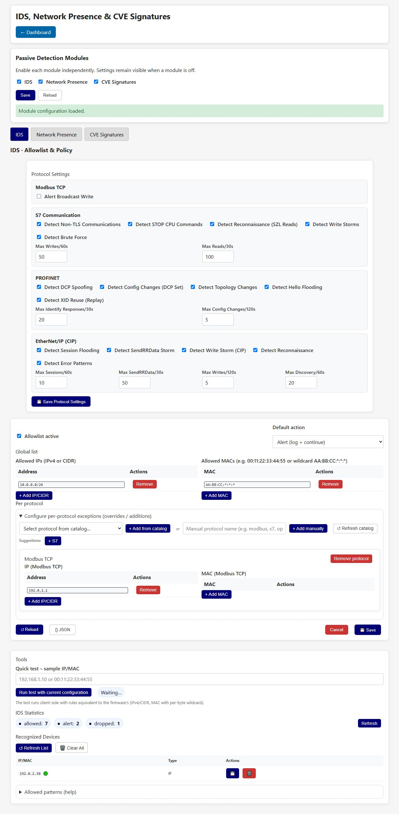

# IDS, Network Presence & CVE Signatures



This page groups three independent passive-analysis modules. Open `/ids`,
`/network-presence` or `/signatures` to select the corresponding panel, or use
the navigation buttons below the shared controls.

These new screenshots show the actual UI with simulated lab data from the local
test fixture. They are not a new on-device validation or a performance measurement.

## Independent switches

Choose the three switches at the top and click **Save** to persist them together.
The page waits for the device response before updating the effective state.

| Switch | Configuration key | What disabling it stops |
| --- | --- | --- |
| General IDS | `ids.general.enabled` | General analysis and protocol-specific IDS hooks. |
| Network Presence | `ids.network_presence.enabled` | New packet observations and automatic learning by the shared tracker. |
| CVE Signatures | `ids.signatures.enabled` | Payload matching and new signature-match threat reports. |

All eight combinations are supported. These flags apply without rebooting.
Processing already in flight and queued reports may finish after a change.
Disabled panels are grayed out and their controls are disabled, but navigation
and the shared switches remain usable. Polling is limited to the visible,
enabled panel and pauses when the browser tab is hidden.

Discovery and Scanner & Fuzzing retain their own independent controls.

## Presence, trust and data retention

Presence continues learning when General IDS is off, but its observations do
**not** grant a writer-authorization bypass. When IDS is on, it can consult the
active tracker for the existing learning/trust policy. A disabled tracker does
not supply stale trust decisions to IDS.

The existing per-protocol writer audit remains separate. An unauthorized-writer
log does not prove packets were physically blocked from reaching a PLC.

Disabling Presence retains learned devices and trust entries in memory; only
explicit reset/delete actions remove them. Existing persistence rules determine
which learned data survives reboot.

Disabling Signatures retains the database. Authenticated management APIs can
still upload, export and reload it, although the WebUI panel controls are disabled.
An enabled detector with an empty database has no patterns to match. A match is
an indicator for investigation, not proof of a CVE.

## Configuration and API

The historical `ids` hierarchy is retained for compatibility, not as a dependency:

```json
{
  "ids": {
    "general": { "enabled": true },
    "signatures": { "enabled": true },
    "network_presence": { "enabled": true }
  }
}
```

Missing flags default to `true`. Legacy `advanced_ids.enabled` and top-level
`network_presence.enabled` remain readable; canonical keys take precedence.
Older configurations therefore retain signature matching.

Authenticated `GET /api/passive-detection/config` returns saved flags and a
`runtime` object with effective states. Authenticated `POST` accepts exactly
three JSON booleans:

```json
{
  "ids_enabled": true,
  "signatures_enabled": true,
  "network_presence_enabled": true
}
```

Updates preserve other settings and use the existing filesystem, CRC and
provisioning-metadata save path. Invalid input or storage failure returns an
error. The UI reports a mismatch if saved and effective flags differ. Legacy
IDS/Presence configuration endpoints remain supported and apply state live.

## Panel guides

- [IDS rules, allowlists and statistics](intrusion-detection-system.md)
- [Network Presence learning and trust](network-presence.md)
- [CVE signature database and editor](cve-signatures.md)
- [Packet/frame processing flow](../architecture/packet-analysis-flow.md)

[Back to the guide index](README.md)
