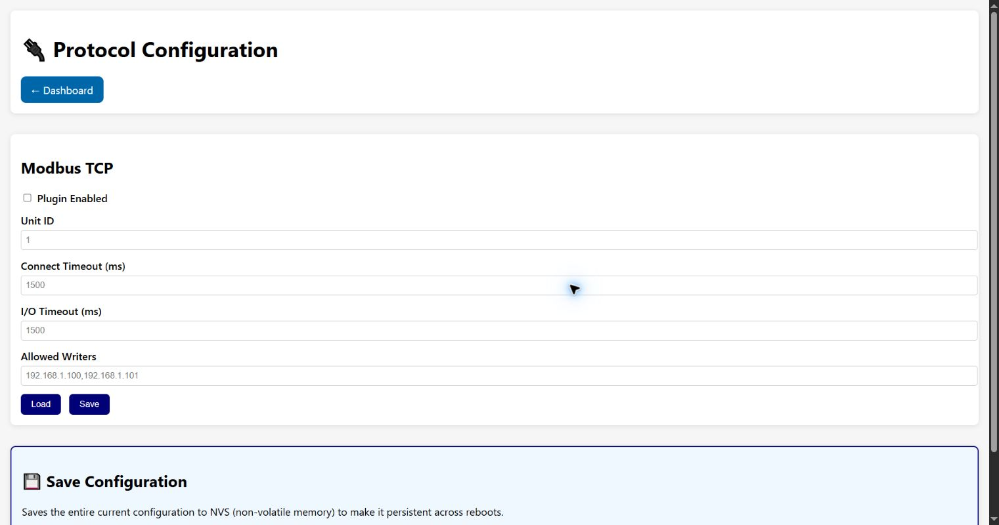

# Protocol Configuration

This page enables and configures the five OT protocol plugins. Each protocol card has **Load** to
read its current configuration and **Save** to update that protocol. **Save to NVS** at the bottom
persists the complete current configuration across reboots; **Show Current Config** displays the
stored document for review.

## Modbus TCP

- **Plugin Enabled** controls whether the Modbus plugin is active.
- **Unit ID** is the default Modbus server/slave identifier.
- **Connect Timeout** and **I/O Timeout** bound connection establishment and request/response wait.
- **Allowed Writers** is the comma-separated list of sources authorized to perform write
  operations. Keep it narrow; it is not a replacement for network segmentation.

## S7 Communication

Connection fields select TCP **Port**, connection timeout, negotiated **PDU Size**, PLC rack and
slot. Security checks test authentication, protection level and—only when explicitly enabled—an
anonymous STOP action. IDS controls detect non-TLS traffic, STOP commands and reconnaissance,
with maximum write/read counts for their time windows.

**IDS Telemetry** reports S7 packet, operation, reconnaissance, alert and blocked-STOP counters.
**Refresh** requests the latest values without changing policy.

## PROFINET

- **DCP Multicast MAC** selects the standard discovery destination.
- **Discovery Timeout** and **Enable Topology Discovery** control DCP discovery behavior.
- Security checks flag default station names, weak security class and unencrypted communication.
- Default-name patterns are comma-separated strings used by the assessment rule.
- IDS options detect DCP spoofing, configuration changes and topology changes; **Max Devices per
  Second** is the response-rate threshold.

The Real-Time Monitoring card exposes PROFINET discovery, configuration and alert counters.

## EtherNet/IP (CIP)

TCP port covers explicit messaging and UDP port covers implicit I/O. Connection/discovery
timeouts bound probes. Security checks inspect CIP Security support, plaintext messaging and an
optional anonymous-write test. IDS rules cover session floods, SendRRData storms, write storms,
reconnaissance and error patterns. The numeric fields define maximum events in their displayed
time windows.

## OPC UA

**Port** selects the server endpoint, normally 4840, and **Timeout** bounds OPC UA operations.
Additional secure-endpoint enforcement is managed on [Security Settings](security-settings.md).

## Operational notes

Disabling a plugin also disables its associated active functions. Some changes affect new jobs or
connections only; reboot during a maintenance window if the runtime and stored configuration no
longer agree. Never enable active security tests against an unapproved target.

[Back to the guide index](README.md)
