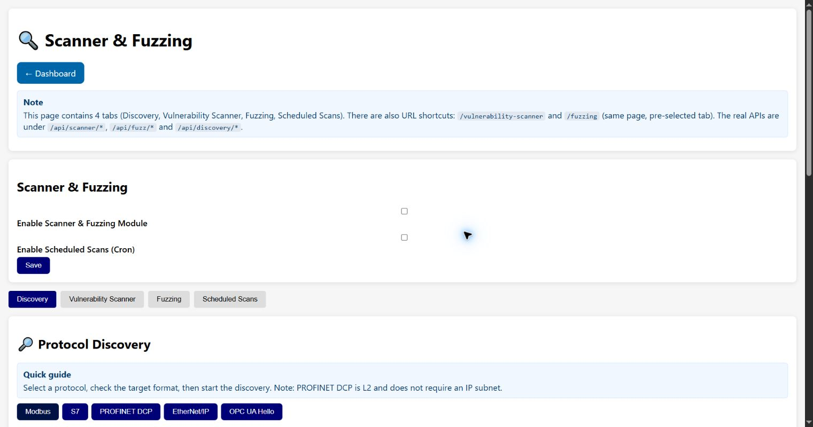

# Protocol Discovery

Protocol Discovery is an independent, non-offensive workspace for finding and characterizing OT
services and devices. Open it from the dashboard or directly at `/discovery`. Vulnerability
scanning, fuzzing and scheduled scans are managed separately on `/scanner` (with the legacy
aliases `/vulnerability-scanner`, `/fuzzing` and `/scheduled-scans`).

## Module controls

Discovery has no Offensive Testing toggle and does not change the Scanner/Fuzzing feature flags.
Its availability depends on the compiled protocol support and the selected network interface.
The assessment controls are intentionally kept on the separate Scanner & Fuzzing page.

## Protocol-specific discovery

Select a protocol, enter the target required by its hint, set a timeout and choose **Start
Discovery**.

| Button | Target and behavior |
| --- | --- |
| **Modbus** | An IPv4 host or subnet, normally using TCP 502. Probes Modbus reachability and configured unit IDs. |
| **S7** | An IPv4 host or subnet, normally TCP 102. Some builds require Ethernet to be ready. |
| **PROFINET DCP** | Uses Layer 2 discovery and therefore does not require an IP subnet. Select the recommended Ethernet/L2 interface value shown by the form. |
| **EtherNet/IP** | An IPv4 host or subnet, normally TCP 44818, using EtherNet/IP discovery. |
| **OPC UA Hello** | An IPv4 host or subnet, normally TCP 4840. A HEL reachability probe is followed by OpenSecureChannel/GetEndpoints metadata discovery when supported. No user session is activated. |

**Active Discoveries** shows running tasks and provides **Cancel**. **Discovery Results** shows
completed findings and **Download JSON** exports the current result set.

### Reading OPC UA results

OPC UA discovery uses binary UA-TCP messages, not HTTP requests. For a successful single
target, the current path uses two TCP connections and five outgoing application messages:
HEL on the first connection, then HEL, OpenSecureChannel, GetEndpoints and CloseSecureChannel
on the second. TCP acknowledgements and network retransmissions are not included in that count.
Security-policy URLs in the response are identifiers; they are not websites queried by the device.

GetEndpoints describes the server's advertised configuration. It does not perform CreateSession,
ActivateSession, a login attempt or application-data reads/writes. Interpret the JSON as follows:

| Field | Meaning and limits |
| --- | --- |
| `server_name` | Application name advertised by the server. `vendor: "Unknown"` means the firmware did not independently identify the manufacturer. |
| `anonymous_advertised` | At least one endpoint advertises an Anonymous user token. The compatibility field `anonymous_login_allowed` has the same meaning, **not a successful login**; `authentication_tested` is `false`. |
| `encryption_available` | At least one endpoint advertises `SignAndEncrypt`. `Sign` alone provides no message encryption. Availability does not mean this discovery connection used encryption. |
| `endpoints` | Individual endpoint URLs, application identifiers, security policies, modes, anonymous-token advertisement and certificate metadata. Use this list to preserve associations; the top-level policy/mode lists are summaries. |
| `certificate` | Summary of the first advertised certificate. Other endpoints can have different certificates; their dates are never merged into one validity interval. |
| `certificate.parse_ok` | Whether the DER metadata parser succeeded. On failure, `parse_error` is provided and unparsed dates are omitted. |
| `certificate.certificates_in_blob` | Number of concatenated DER certificates. Reported identity/dates describe the leaf certificate (`metadata_subject: "leaf_certificate"`), not a merged issuer chain. Parsing is bounded to 16 certificates and 64 KiB; it does not establish trust. |
| `certificate.not_before_ms`, `not_after_ms` | Signed UTC Unix milliseconds decoded from the certificate, not device uptime. These fields do not by themselves prove trust. |
| `certificate.time_checked` | A plausible device UTC clock was available. Without it, `expired`, `not_yet_valid` and `time_valid` are `null`, not `false`. Synchronize device time before interpreting date checks. |
| `certificate.valid`, `self_signed` | `null` during discovery: full trust/identity and self-signature verification were not performed. `self_issued` only means issuer and subject DER names match. |

The `vulnerabilities` list contains deduplicated posture observations, including informational
limitations. Anonymous advertisement alone is not proof of an exploitable vulnerability.
Repeated certificates across endpoints are normal and are not evidence of a certificate-chain loop.
Concatenated leaf/issuer certificates are supported as specified by
[OPC UA Part 6, Certificate Chains](https://reference.opcfoundation.org/specs/OPC-10000-6/6.2.6).
See [OPC UA assessment limits](vulnerability-scanner.md#opc-ua-assessment-limits) for scanner results.

## General Discovery

- **Ping sweep** looks for responsive hosts.
- **Port scan** checks the comma-separated port list.
- **Target subnet or IP** accepts an individual address or CIDR range.
- **Interface** selects the OT Ethernet interface used by the discovery engine.
- Per-host and connection timeouts prevent a slow host from holding the scan indefinitely.
- **Max hosts** bounds the amount of work; keep it small on large or sensitive networks.

Discovery generates network traffic and can trigger OT monitoring. Start with narrow targets,
longer delays and explicit authorization.

[Back to the guide index](README.md)
