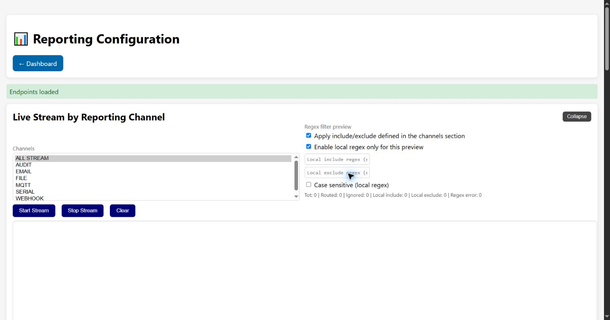

# Reporting Configuration

Reporting Configuration controls how internal events are previewed, queued, formatted, filtered
and delivered to serial, files, MQTT, webhooks, email and other supported channels.

## Live Stream by Reporting Channel

Select one or more channels or **ALL STREAM**, optionally apply channel include/exclude filters,
and add local regular expressions for this browser preview. **Case sensitive** applies to the
local regex. The counters show total events, routed events, ignored events, local include/exclude
matches and regex errors.

**Start Stream** opens the event stream, **Stop Stream** closes it, **Clear** clears the browser
display, and **Collapse** hides the panel without changing reporting configuration. A local preview
filter does not change device-side routing.

## Queue Status

| Metric | Meaning |
| --- | --- |
| **Queued** | Events waiting for a reporter. |
| **Capacity** | Configured queue slots. |
| **Usage %** | Occupied fraction of the queue. |
| **Payload** | Estimated queued data size. |
| **Sync Pending** | Dirty events waiting to be written to persistent backup. |
| **Flush Interval** | Worker flush/reporting interval. |

**Refresh** reloads metrics. **Flush Queue** immediately asks reporters to process queued events;
delivery still depends on endpoint reachability.

## Reporting Channels

**Load Channels** creates a card for every configured channel. Each card can enable the channel,
select JSON/CEE/LEEF/CEF format, select Reports Only or Verbose output, enable filters and choose
case sensitivity. Include filters admit matching events; exclude filters suppress matches. File
reporting also offers log download.

### Channel-specific endpoint settings

The MQTT, Webhook and Email tabs include an endpoint panel below the common channel options.
Use the dedicated **Save ... configuration** button to persist only that channel while retaining
all other reporting sections. Password inputs are intentionally blank: leaving a password blank
preserves the value already stored on the device.

* **MQTT**: broker host and port, client ID, topic prefix, credentials, QoS, retain flag,
  timeouts, reconnect interval and optional CA PEM.
* **Webhook**: URL, timeout and request headers as a JSON object.
* **Email / SMTP**: server and port, credentials, sender, recipients, subject prefix, SSL/TLS
  switches, timeout and retry attempts. Recipients may be entered one per line or comma-separated.
* **Serial** and **Audit** have no endpoint-specific fields; use their common options and filters.
* **FILE** and **GPIO** are light-blue navigation tabs. They open the dedicated `/logging` and
  `/gpio` pages so their storage and pin mappings are not duplicated here.

The endpoint editor remains hidden for compatibility with existing installations. The channel
panels use the same `/api/report/endpoints` persistence path and apply network endpoint changes
immediately when the backend accepts the request.

The panel reflects the complete endpoint schema. A field is persisted even when the selected
reporter build does not currently consume it (for example optional webhook headers or retry
metadata); those values remain available for compatible reporter implementations.

## Reporting Endpoints

**Load** displays endpoint JSON and **Save** validates/applies it. Endpoint data can contain broker
credentials, webhook tokens, SMTP credentials and addresses. Keep exports private and never place
real endpoint secrets in the public repository.

[Back to the guide index](README.md)
