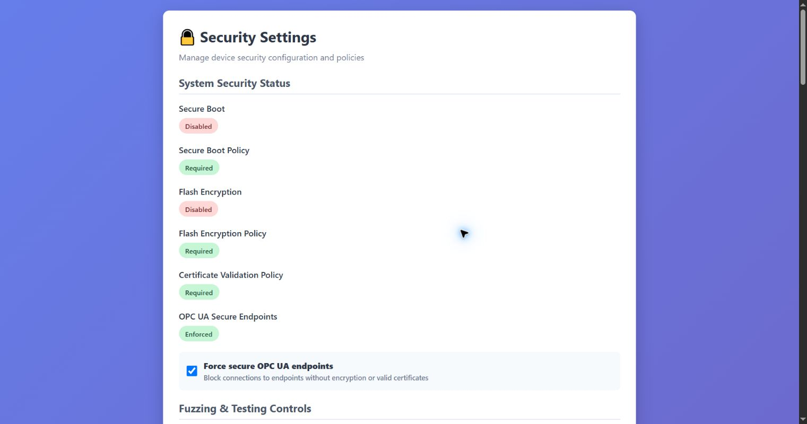

# Security Settings

Security Settings combines policy indicators, offensive-test interlocks, alert routing, API-key
health and management-interface rate limiting. The page is available at `/security` even though
the current dashboard has no direct button for it.

## System Security Status

Status badges distinguish actual hardware state from configured policy:

- **Secure Boot** and **Flash Encryption** report detected hardware/runtime state.
- **Secure Boot Policy** and **Flash Encryption Policy** show whether configuration requires them.
- **Certificate Validation Policy** reports certificate-validation enforcement.
- **OPC UA Secure Endpoints** reports whether insecure endpoints are blocked.

A green Required policy beside a red Disabled hardware state means the policy requests a feature
that is not actually active. Treat the hardware status as authoritative and investigate before
deployment. **Force secure OPC UA endpoints** blocks endpoints without encryption or valid
certificates.

## Fuzzing and hardware interlock

The fuzzing switch permits active assessment traffic. The **Effective Status** reflects both
software permission and the physical GPIO interlock. The same global control is also available
above the tabs on the [Scanner & Fuzzing page](vulnerability-scanner.md).

In public/release firmware, **Enable fuzzing GPIO gate**, **Require switch ON to allow fuzzing**,
GPIO number, active level and pull mode are locked. The firmware always uses the board profile's
default pin and requires the asserted contact; the API enforces the same rule even if a client
tries to submit a handcrafted request. With **Switch state = OFF**, **Effective Status** must be
**Blocked**. The page explains that the configured GPIO must be connected to the adjacent GND.

Only a development image built with the explicit `ESP32_OT_ALLOW_OFFENSIVE_CONFIG_OVERRIDE=1`
authorization unlocks those controls. This is independent of `ESP32_OT_EMBEDDED_CONFIG`, which
only selects whether configuration is embedded or provisioned. Verify pin availability and the
board-specific default pin in the [offensive-testing interlock guide](../security/offensive-testing-interlock.md)
before wiring an interlock.

## Alert Policy

- Email controls enable alerts, subject, minimum interval and recipient list.
- Webhook controls enable delivery, URL and token/header value.
- GPIO controls enable physical alert output and select critical, warning and buzzer pins.

These fields can contain secrets or personal addresses. Do not expose Security Settings or config
exports in public logs/screenshots.

## API Key Health

The counters show total and enabled keys, keys requiring rotation, and keys disabled pending
rotation. Rotation warnings mean dependent integrations may stop authenticating until their keys
are replaced.

## Rate Limiting and DoS protection

Enable the limiter, then set maximum requests per client per minute, authentication-failure
threshold, block duration and cooldown. Statistics show tracked/blocked clients, blocks issued and
requests blocked. **Unblock Client** removes the current block for the supplied IP; confirm the
source is legitimate first.

**Save Settings** writes the page values and **Reload** discards browser edits and reloads the
device state.

[Back to the guide index](README.md)
