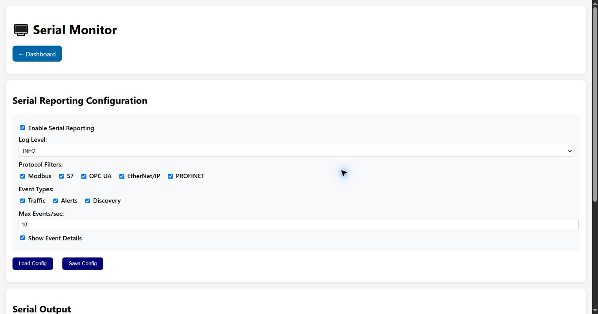

# Serial Monitor

The browser Serial Monitor configures the serial reporting channel and displays its event output.
It is separate from a direct USB/UART terminal used for boot messages and setup credentials.

## Serial Reporting Configuration

- Enable/disable the serial reporting channel.
- Choose INFO, WARNING, ERROR or DEBUG minimum log level.
- Select Modbus, S7, OPC UA, EtherNet/IP and PROFINET protocol filters.
- Select traffic, alert and discovery event types.
- **Max Events/sec** rate-limits output.
- The details option controls whether expanded event information is included.
- **Load Config** reloads stored settings; **Save Config** applies edits.

Lower severity thresholds and many selected categories increase volume and can affect readability
or device resources.

## Serial Output

**Start** begins polling/streaming output, **Stop** ends it and **Clear** empties the browser view.
Refresh rate selects 1, 2 or 5 seconds. Clearing the browser does not delete persisted log files.

Do not paste boot output containing setup tokens, AP passwords, session identifiers or network
credentials into public issues.

[Back to the guide index](README.md)
