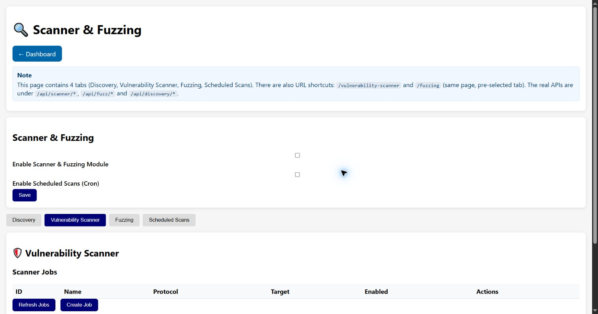

# Vulnerability Scanner

The Vulnerability Scanner tab manages reusable assessment jobs. A job describes what to scan,
not a confirmed vulnerability. Results must be reviewed against device model, firmware version
and vendor advisories.

## Scanner jobs

**Refresh Jobs** reloads the job table. Each row shows ID, name, protocol, target, enabled state
and actions:

- **Run** executes the selected job now.
- **View Result** loads its last result into the result panel.
- **Delete** permanently removes the job definition.

## Create Scanner Job

| Field | Meaning |
| --- | --- |
| **Job Name** | Human-readable identifier used in the table and logs. |
| **Protocol** | Selects the protocol-specific scanner implementation. |
| **Target** | Host and, where applicable, service port accepted by that scanner. |
| **Scan types** | One or more checks exposed for the chosen protocol. Unsafe or proof-oriented checks should remain disabled unless specifically authorized. |
| **Interval (seconds)** | Recurrence metadata for the job. Use Scheduled Scans for explicit cron timing. |

Choose **Create** to store the job or **Cancel** to discard the form. **Last Scan Result** displays
the most recent result and **Download JSON** saves it for offline review.

## Interpreting output

Findings are evidence from implemented checks and may be false positives or incomplete. A
connection failure may mean filtering, routing, target load, an unsupported service, or a timeout;
it does not establish that a target is secure. Correlate the output with [CVE Signatures](cve-signatures.md),
asset inventory and vendor documentation.

## Scheduled Scans tab

The fourth tab on the shared page manages cron-like execution. **Refresh** reloads schedules and
**Create Schedule** opens the form. A schedule has a name, Vulnerability or Discovery scan type,
target, and five time fields: minute, hour, day of month, month and day of week. `-1` means “any”;
day of week uses `0` for Sunday through `6` for Saturday. **Enabled** determines whether the
scheduler may run it.

Existing rows can **Run now**, enable/disable, edit or delete a schedule. Scheduling is available
only when both Scanner & Fuzzing and Scheduled Scans are enabled. Avoid overlapping jobs and
choose maintenance windows appropriate for the target network.

[Back to the guide index](README.md)
