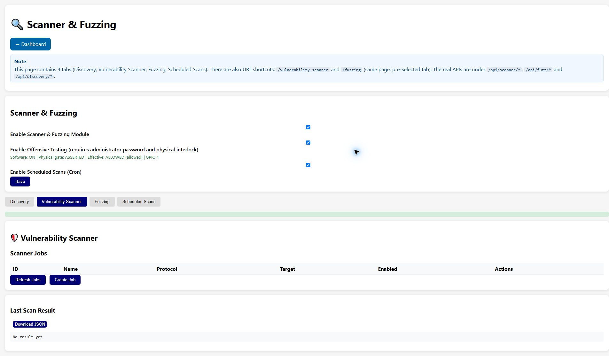
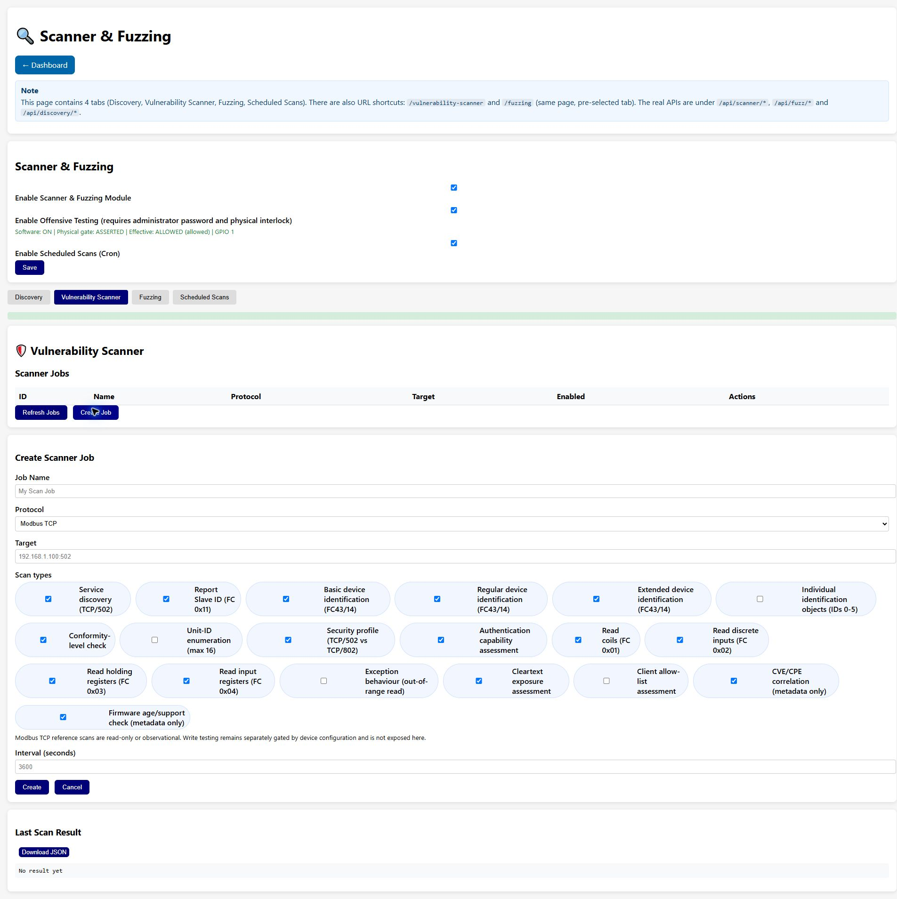

# Scanner & Fuzzing

The **Scanner & Fuzzing** page is the shared control centre for protocol discovery,
vulnerability-scanner jobs, fuzzing jobs and scheduled scans. The screenshot above is a
read-only capture of the v0.1.3 interface on 2026-08-29. Counters, jobs and the effective
security state are runtime values and will differ between devices.

The page is available at `/vulnerability-scanner` and `/fuzzing`; both routes render this page
with a different tab selected. The browser session is authenticated through the `sid` query
parameter. Treat that value as a temporary credential and never copy it into documentation,
screenshots or issue reports. The corresponding API families are `/api/discovery/*`,
`/api/scanner/*` and `/api/fuzz/*`.

## Global controls

The controls above the tabs apply to the whole assessment interface:

| Control | Effect |
| --- | --- |
| **Enable Scanner & Fuzzing Module** | Enables the discovery, vulnerability-scanner and fuzzing services. Saving the switch does not create a job. |
| **Enable Offensive Testing (requires administrator password and physical interlock)** | Enables the global authorisation policy for state-changing or disruptive probes. Turning it on prompts for the administrator password; the physical gate must also be asserted. |
| **Enable Scheduled Scans (Cron)** | Allows the scheduler to execute enabled schedules. It is unavailable while the scanner module is disabled. |
| **Save** | Persists the feature switches through the authenticated API. |

The line below the offensive-testing switch reports four independent values:

- **Software** is the persisted administrator authorisation.
- **Physical gate** is the sampled GPIO contact (`ASSERTED` or `OPEN`).
- **Effective** is the result used immediately before an active operation is sent.
- **GPIO** is the board profile's selected interlock pin.

The policy is fail-closed. Read-only discovery and observational vulnerability checks can run
while the policy is blocked, but proof, write, reset, STOP/START and DoS-oriented checks remain
blocked. This policy is not the IDS `allowed_writers` list and is not the per-job **Safe Mode**
checkbox. See [Offensive-testing interlock](../security/offensive-testing-interlock.md) for
password handling, persistence and wiring.

### Default physical interlock pins

All public builds use an active-low input with the internal pull-up enabled. Leave the contact
open for the safe/blocked state; assert the gate by connecting the selected GPIO directly to a
nearby board GND. Do not inject an external voltage. The defaults are compile-time board
profiles:

| Board | Default GPIO |
| --- | ---: |
| LILYGO T-POE Pro | GPIO15 |
| Waveshare ESP32-S3-ETH | GPIO16 |
| Waveshare ESP32-P4-ETH | GPIO16 |
| GUITION JC-ESP32P4-M3-DEV | GPIO1 |

The live GUITION capture above therefore shows `GPIO 1`. GPIO15 on some T-POE Pro revisions is
a boot-strap pin; follow the board-specific warning before wiring it. Pin assignments and
reserved-pin validation are documented in the [interlock guide](../security/offensive-testing-interlock.md).

## Vulnerability Scanner tab

The **Vulnerability Scanner** tab manages reusable jobs. The table contains **ID**, **Name**,
**Protocol**, **Target**, **Enabled** and **Actions**. **Refresh Jobs** reloads the table,
**Run** starts one job immediately, **View Result** loads its last result, and **Delete** removes
the job definition after confirmation.

### Creating a job

Select **Create Job** to open the form shown above:

| Field | Meaning |
| --- | --- |
| **Job Name** | Human-readable identifier used in the table and audit logs. An empty value becomes `Unnamed Job`. |
| **Protocol** | Selects the protocol-specific scanner implementation. |
| **Target** | Hostname or IPv4 address, optionally followed by the service port expected by the scanner (for example `192.168.1.100:502`). |
| **Scan types** | Protocol-specific checks. The checkboxes are rebuilt when the protocol changes; defaults are deliberately conservative. |
| **Interval (seconds)** | Recurrence metadata used by scheduled execution. It does not start a job by itself. |

Press **Create** to store the disabled job definition, or **Cancel** to close the form. Keep
targets inside the approved assessment scope. A job is a description of checks to run, not a
finding or proof of a vulnerability.

### Available scan types

The current v0.1.3 build exposes the following controls. Items marked **default** are selected
when a new job is created; items marked **active** can change target state or create load and
must remain disabled unless the test plan explicitly authorises them.

| Protocol | Checks exposed by the UI |
| --- | --- |
| **Modbus TCP** | Service discovery (TCP/502) **default**; Report Slave ID (FC 0x11) **default**; Basic, Regular and Extended Device Identification (FC43/14) **default**; Individual identification objects (IDs 0–5); Conformity-level check **default**; Unit-ID enumeration (max 16); Security profile (TCP/502 vs TCP/802) **default**; Authentication capability **default**; Read Coils, Read Discrete Inputs, Read Holding Registers and Read Input Registers **default**; out-of-range exception behaviour; cleartext exposure **default**; client allow-list assessment; CVE/CPE correlation (metadata only) **default**; firmware age/support check (metadata only) **default**. |
| **S7 Communication** | SZL fingerprint **default**; SetupComm communication information **default**; block inventory **default**; optional one-byte read probes; CPU protection level **default**; unauthenticated information access **default**; STOP capability assessment; `PROOF: send STOP` (active); `PROOF: send START/Restart` (active). |
| **OPC UA** | Anonymous access, weak security policies, certificate validation and certificate-chain loop **default**; manual default-credential and authorisation/IDOR checks; brute-force resilience; ConditionRefresh, chunk-flooding and browse-loop DoS checks (active). |
| **EtherNet/IP** | ListIdentity integrity, session security, CIP Security advertisement, ListServices consistency and UDP/2222 I/O exposure **default**; write-capability, reset-capability and ForwardOpen risk assessments (active). |
| **PROFINET** | DCP Identify-All, security-class evaluation, signature presence/validity, default/generic device name, unencrypted RT/DCP note and DCP Set reconfiguration-risk note **default**. |

Modbus TCP reference scans are read-only or observational. Modbus write testing is not exposed
by this form and remains separately controlled by the device configuration and the global
offensive-testing policy. The same policy is re-evaluated immediately before every active S7,
OPC UA or EtherNet/IP probe and every unsafe fuzz case.

### Results and asynchronous execution

After **Run**, the page polls for the result for up to one minute. While the job is running,
`GET /api/scanner/result` may return HTTP 404; this means that no completed result is available
yet and is not, by itself, a scan failure. **Last Scan Result** shows a human-readable summary
and the structured JSON payload after completion. **Download JSON** exports that payload for
offline review, evidence retention or CI processing.

Treat every result as assessment evidence, not a definitive security verdict. Correlate
connection failures, unsupported function codes and incomplete metadata with routing, target
load, packet captures, asset inventory and vendor advisories. Use [CVE Signatures](cve-signatures.md)
for the local signature database and [Reporting](reporting.md) for export and alert channels.

## Discovery, Fuzzing and Scheduled Scans tabs

- **Discovery** starts targeted or general protocol discovery. PROFINET DCP is a Layer-2
  operation and does not require an IP subnet.
- **Fuzzing** creates protocol-specific jobs and exposes a per-job **Safe Mode** switch. Safe
  Mode keeps a job read-only; disabling it does not bypass the global offensive-testing policy.
- **Scheduled Scans** creates cron-like records with minute, hour, day-of-month, month and
  day-of-week fields. `-1` means “any”; day-of-week uses `0` for Sunday through `6` for
  Saturday. A schedule can run only when both the scanner module and scheduled scans are
  enabled.

Avoid overlapping jobs and choose a maintenance window appropriate for the OT network. Stop
active assessment before changing cabling, rebooting the device or opening the physical
interlock.

[Back to the guide index](README.md)
